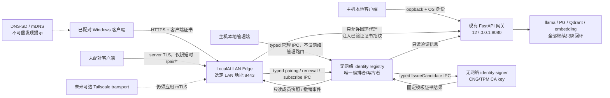

# P3b 局域网身份与准入：架构决策包

> 日期：2026-07-28  
> 性质：只读评审稿；未修改 `.localAI` 仓库，未运行其测试、服务、数据库或证书操作  
> 分析基线：`main @ 2e68617`，P3a S0–S9 已验收；最终复核时主 Claude 已另行提交 `f32f92f`（D42 客户端六界面与功能细化），工作树干净  
> 并发提示：本包未参与或覆盖 D42；只读复核未见其改变 P3b 的 LAN/mTLS 核心边界，但主 Claude 采用本包时仍须以当前 `HEAD` 为准串行合并中央决议  
> 适用范围：P3b 设计与实施契约；不包含 P3c 完整客户端 UI，不包含 iOS 全功能端，不包含公网暴露

## 0. 最终结论

P3b 应采用下面这条主线：

> **家庭 LAN 是当前必需且完全独立的传输；应用自有 mTLS 是恒定设备身份；Tailscale 是否保留为额外漫游传输仍由用户显式裁定，但无论答案如何都不得进入 LAN 的身份与离线可用性关键路径。**

主机新增一个独立的 Windows LAN Edge，唯一对 LAN 暴露 `:8443`。它终止 TLS、验证客户端证书、检查成员状态并代理到仍只监听 `127.0.0.1:8080` 的现有 FastAPI 网关。客户端私钥留在 CNG/TPM 中，WebView 永远看不到证书、私钥或任意网络能力。

这不是把现有网关改成 `0.0.0.0`，也不是给它加一个 token。Windows 没有能把证书、服务监听、防火墙和 DNS-SD 真正包进同一个 ACID 事务的机制；P3b 必须把开放过程实现为**可恢复的 activation saga**：准备 → 验证 → 开防火墙/监听 → 广播 → 验收。每一步都有持久化状态、幂等重试和反向补偿；任何一步未完成或重启恢复不确定时都回到纯回环。

### 建议冻结的十项决定

1. **当前必需路径：纯 LAN + 应用 mTLS。**
2. **Tailscale：待用户回答“是否会带 Windows 笔记本外出使用全功能”。** 推荐按现行 D34 移出 LocalAI；若用户回答“会”，也只能作为附加 transport，不能替代应用 mTLS。
3. **LAN 名称：** `localai-<hub-id-short>.local`；真正稳定身份是 `hub_id + 项目 CA`，`.local` 只是稳定的 LAN/TLS 路由名；显示名称另设，随时可改。
4. **发现协议：** DNS-SD/mDNS 服务 `_localai._tcp.local.`（项目暂用服务类型）；发现结果只是路由提示，不是信任证据。
5. **LAN 唯一入口：** `https://localai-<hub-id-short>.local:8443`；现有 `127.0.0.1:8080` 保持内部入口。
6. **TLS 终止：** 独立 Windows LAN Edge，首选 Kestrel + YARP；不让 Uvicorn/FastAPI 直接承担客户端证书身份。
7. **客户端传输：** Windows 原生 transport 进程/库持有证书，未来由 Tauri 通过受限 IPC 调用；不使用 WebView `fetch` 或通用 Tauri HTTP 插件处理 mTLS。
8. **初次信任：** 主机短时开启配对窗口，双方比较由完整配对 transcript 派生的六词短码；只核对客户端自报指纹不够。
9. **撤销：** TLS 链验证和本地成员表双重检查；成员表是即时撤销真相源，P3b 不依赖在线 CRL/OCSP，CRL 只作为离线导出物。
10. **权限：** P3a 已验收边界优先。LAN 客户端拥有完整客户端形态，但默认仍是 `LAN_DEVICE`：只读 S0/S1，不能读 S2、不能编辑记忆、不能碰 L4 或主机管理。

### 当前实现基线

| 项目事实 | 只读核对结果 |
|---|---|
| P3a | `2e68617` 已完成 S0–S9 验收 |
| 中央文档 HEAD | `f32f92f` 新增 D42；未改 P3b LAN/mTLS 实现，采用本包时仍需串行合并 |
| FastAPI 网关 | `127.0.0.1:8080`，现有本机身份为源端口 → PID → Windows owner |
| llama-server | `127.0.0.1:18081`，当前尚无后端 API key |
| PG / Qdrant / embedding / Open WebUI | 均只绑定回环；P3b 不应改变 |
| TLS / CA / mTLS | 仓库中尚无实现或证书资产 |
| Windows 客户端 | `20-client-win` 仍只有占位文件 |
| 私密状态目录 | `${state}/secrets` 已有强 ACL 且排除出备份，但 P3b 需进一步按 CA、服务器叶密钥和公有验证材料拆权限 |
| 已有 LAN 授权底座 | P3a 已定义 `CallerTier.LAN_DEVICE`，但尚未与真实证书 principal 绑定 |

## 1. 先修正两个项目内冲突

### 1.1 “全功能 LAN 客户端”不能等于“主机管理员”

`DECISIONS.md:983-987` 的 D34 把 LAN Windows 客户端写成“全部能力，含 L4”。但 P3a 已提交并验收的代码明确规定：

- `LAN_DEVICE` 只可读 S0/S1；
- S2 只允许 `TRUSTED_LOCAL`；
- LAN 设备不能编辑、删除、标密或处理待审记忆；
- L4 提议、批准和执行均只允许 `TRUSTED_LOCAL`。

对应证据位于：

- `10-core/memory/tainted.py:190-212`
- `10-core/memory/panel.py:4-19,48-56`
- `10-core/memory/l4_proc.py:9-11,51-55`

建议正式把 D34 中的“全功能”改写为：

> **已配对 LAN Windows PC 拥有完整客户端形态和运行时能力；数据敏感度、记忆写操作、L4 和主机管理仍按身份分层。**

建议权限矩阵：

| 能力 | 主机本地 `TRUSTED_LOCAL` | 已配对 LAN `LAN_DEVICE` |
|---|---:|---:|
| 聊天、语音、宠物、普通模型调用 | 是 | 是* |
| 读取 S0/S1 记忆 | 是 | 是 |
| 读取 S2 | 是 | 否 |
| 编辑/删除/标密/确认记忆 | 是 | 否 |
| 运行时状态查看与已授权操作 | 是 | 是，受 P4 六元组约束 |
| L4 提议/批准/执行 | 是 | 否 |
| CA、成员批准/吊销、备份 | 仅主机本地管理端 | 否 |

P3b 只负责把已验证证书映射为可信 principal，**不得借机放宽 P3a 权限**。

\* “宠物可用”只表示该客户端有资格承载同一个 Vigil 实体；实际在场仍受 D40 的唯一实体、单一 lease 和 `desktop_floor` 约束，绝不是每台 PC 各生成一个宠物实例。

### 1.2 D34 与“Tailscale 的唯一用途”互相冲突

D34 已取消全功能远程接入，人在外走外联文本/语音通道；但当前待决项又说 Tailscale 的唯一价值是“带 Windows 笔记本出门使用全功能”。这两条不能同时成立。

因此本决策包只冻结不依赖用户选择的部分：

- **LAN 命名、发现、TLS、配对、撤销和拔 WAN 验收一律不依赖 Tailscale。**
- 若用户回答“不会带全功能笔记本外出”：LocalAI 移除 Tailscale 依赖；客户端软件可留在机器上供其他用途。
- 若用户回答“会”：新增正式决议修订 D34，保留 Tailscale 为额外 transport；应用 mTLS、成员表和 LAN 离线路径全部保持。
- 在用户明确回答前，不得把任一路径写成最终已决，更不得因等待答案而降低 LAN mTLS 标准。

旧 D14/D14a 的 WebAuthn RP ID 与 `tail71cfd7.ts.net` 不再是 LAN 身份根。`tailscale cert` 提供的是由 Let’s Encrypt 签发、用于节点 FQDN 的 HTTPS 服务器证书；官方没有提供用它签发 LocalAI 客户端证书或充当本项目成员 CA 的机制。申请 `*.ts.net` 证书还会把机器名和 tailnet DNS 名写入公开 Certificate Transparency 日志。[Tailscale HTTPS certificates](https://tailscale.com/docs/how-to/set-up-https-certificates)

## 2. 推荐架构



### 2.1 为什么增加独立 LAN Edge

现有网关已经有大量已验收的本机身份、记忆、E1 与流式逻辑。让它直接承担 LAN TLS 会同时引入三个问题：

1. Uvicorn 虽有 `--ssl-certfile`、`--ssl-cert-reqs`，但不能据此假定客户端证书会以可靠、稳定的 ASGI 身份进入应用。ASGI 确实定义了 TLS 扩展，但具体服务器必须实现。[ASGI TLS extension](https://asgi.readthedocs.io/en/latest/specs/tls.html) · [Uvicorn settings](https://www.uvicorn.org/settings/)
2. 严格握手 mTLS 无法接收尚无证书的初次 CSR；配对例外必须被明确建模。
3. TLS、证书生命周期、撤销和 LAN 限流会污染现有网关的安全边界。

Kestrel 原生支持：

- TLS 1.2/1.3；
- `AllowCertificate`：请求客户端证书，但无证书时仍可进入封闭的配对路由组；
- 自定义根信任、EKU、有效期和证书认证；
- 将验证后的证书转成 principal；
- YARP 在代理前执行授权并显式移除/重建身份头。

官方文档：[Kestrel client certificate modes](https://learn.microsoft.com/en-us/dotnet/api/microsoft.aspnetcore.server.kestrel.https.clientcertificatemode) · [ASP.NET Core certificate authentication](https://learn.microsoft.com/en-us/aspnet/core/security/authentication/certauth) · [YARP request transforms](https://learn.microsoft.com/en-us/aspnet/core/fundamentals/servers/yarp/transforms-request)

这里不能照搬框架默认值：ASP.NET Core 的 `ValidateCertificateUse=true` 会把“没有 EKU”的证书视为可用于所有用途，认证失败默认也是 403。P3b 必须自定义强制 `clientAuth` 明确存在，并由项目自己的成员授权中间件对“密码学有效但成员未知/停用/吊销”返回既定 401；TLS 握手失败没有 HTTP 状态。不得启用会把动态成员状态缓存成长期授权结果的证书认证缓存。

| TLS 终止方案 | 判断 |
|---|---|
| Uvicorn/FastAPI 直接终止 | 不选。配对例外、客户端证书传入 ASGI、动态撤销和网关业务逻辑耦合过深 |
| Caddy 反代 | 可作为回退；mTLS 与身份头可做，但 Windows CNG 服务器密钥、成员表和主动断流需要额外集成 |
| **Kestrel + YARP** | **推荐。** Windows 证书存储、CNG/TPM、可选客户端证书、自定义信任和代理授权在同一原生边缘层 |
| 自写 Rust TLS edge | 不选作首版。密码学适配与长期维护成本没有必要 |

### 2.2 进程与最小权限

建议拆成五个权限域：

| 进程/组件 | 可读 | 可写 | 明确不得持有 |
|---|---|---|---|
| `localai-lan-edge` | 服务器叶证书、公共 CA、成员只读快照 | 连接审计；调用受限 pairing IPC | 身份数据库写权限、CA 签发私钥、记忆库、L4 凭据 |
| `localai-identity-registry` | 成员表、待批队列、轮换计划 | 唯一的 pending/批准/签发编排/吊销/generation 事务 | 网络监听、CA key、业务数据 |
| `localai-identity-signer` | CA key 使用权、固定签发模板 | 仅向 registry 返回固定模板证书、签发审计 | 网络监听、身份数据库、任意签名接口 |
| 主机本地管理端 | CA 公共材料、成员表、待批队列 | 仅向 registry 发批准/吊销/开窗命令 | 身份数据库直接写、signer IPC、CA key 直接读取、LAN 监听能力 |
| FastAPI 网关 | 成员只读映射、现有业务数据 | 现有审计/业务路径 | CA 签发私钥、成员批准能力 |

LAN Edge 使用独立低权限 Windows 服务账户。它必须：

- 丢弃所有来自客户端的 `X-LocalAI-*` 头；
- 只把 TLS 连接中取得的 `cert_sha256`、成员 principal 和 `identity_generation` 转给网关；
- 只代理固定 upstream `127.0.0.1:8080`，不接受任意 URL；
- 由 D30 的本机 PID/SID 机制识别为新增的专用低信任传输档 `LAN_EDGE`，**永不落入现有兜底 `trusted-local`**；
- 任何其他本机进程伪造同名头都被拒。

`LAN_EDGE` 不是业务 caller tier，只证明“请求确实来自边缘代理”。网关必须同时验证由 Edge 从 TLS 会话生成的叶证书 SHA-256、成员表记录和单调 `identity_generation`，再把该请求固定映射为 `LAN_DEVICE`。缺少证书 principal、指纹未知/吊销、成员快照过旧或身份头不完整时一律 fail-closed；即使 Edge 服务账户或代理进程被攻陷，网关自身的路由授权也必须使它无法进入 S2、记忆写入、L4 和主机管理路径。

匿名 `/pair/*` 引导路由组**只存在于 LAN Edge**：它只能通过 ACL 限定的配对 named-pipe 方法把限长、规范化请求交给 identity registry；Edge 不直接打开身份数据库。registry 只执行配对状态机、做幂等与限流，绝不代理到 FastAPI、模型、记忆或任何业务路由。现有 FastAPI 网关没有匿名配对例外。

`localai-identity-registry` 是常驻 Windows 服务、身份数据库唯一写者、身份流程唯一编排者和 generation 事件唯一发布者。所有 IPC 都按调用方服务 SID 暴露固定方法：

| 调用方 → 目标 | 允许的 typed 方法 |
|---|---|
| Edge → registry | `SubmitEnroll`、`GetPairStatus`、`ClaimPairCandidate`、`CompletePair`、`BeginRenewal`、`GetRenewalStatus`、`ClaimRenewalCandidate`、`CompleteRenewal`、`SubscribeIdentity(after_generation)` |
| host-admin → registry | `Open/ClosePairWindow`、`Approve/DenyRequest`、`RevokeCertificate/Device`、`ListSecurityEvents` |
| registry → signer | `IssueServerCandidate`、`IssueClientCandidate`；参数必须携带 registry 生成的一次性 issuance ticket、hub/device/generation 与 CSR/SPKI |

signer 只接受 registry 服务 SID，并再次校验证书模板、ticket、generation 和算法；没有 host-admin→signer 或 Edge→signer 路径。registry 把签发结果和状态变更写入同一事务/outbox 后再回复调用方。Edge/网关必须保持只读订阅的健康连接：一旦订阅断开，立即停止接受新的 LAN 业务并中止现有 LAN 流；重连后按最后已见 generation 回放 durable outbox，再取得完整快照并校验水位，全部追平后才恢复。周期快照是完整性后备，不把 IPC 断连当成可以静默忽略的“通知丢失”。

这些 named pipe 必须设置 `PIPE_REJECT_REMOTE_CLIENTS`、精确到服务 SID 的 DACL 与 first-instance 防抢占；服务端用 `GetNamedPipeClientProcessId` 取得 PID 后复核进程 token/service SID，客户端用 `GetNamedPipeServerProcessId` 复核预期 registry/signer 服务身份。仅凭 pipe 名或同一普通用户 SID 不算认证。[CreateNamedPipe / PIPE_REJECT_REMOTE_CLIENTS](https://learn.microsoft.com/en-us/windows/win32/api/winbase/nf-winbase-createnamedpipea) · [GetNamedPipeServerProcessId](https://learn.microsoft.com/en-us/windows/win32/api/winbase/nf-winbase-getnamedpipeserverprocessid) · [Named pipe security](https://learn.microsoft.com/en-us/windows/win32/ipc/named-pipe-security-and-access-rights)

`Issue*Candidate` 必须以至少 256-bit issuance ticket 做跨进程幂等键：signer 在回复前把 ticket→证书结果写入仅 signer 可写的持久 journal，重复 ticket 只返回同一证书；registry 也以 ticket 建唯一约束。注入“签完后 signer/registry 任一方崩溃”不能产生第二张证书或第二个 serial。

## 3. Windows 客户端传输

### 3.1 不把密钥交给 WebView

未来 Tauri UI 只可调用以下有限操作：

```text
discover()
begin_pair(hub_id) -> opaque_pair_handle + SAS
pair_status(opaque_pair_handle)
request(profile_id, api_operation, bounded_payload)
stream(profile_id, api_operation, bounded_payload)
```

它不能：

- 读取私钥或导出 P12/PFX；
- 自选证书；
- 提交任意 URL、任意 header 或任意代理地址；
- 要求原生层忽略 CA、主机名、有效期或 EKU 错误。

通用 Tauri HTTP 插件和 `reqwest::Identity` 主要接收 PEM/PKCS#12/PKCS#8 私钥材料，不适合直接使用 TPM 中不可导出的密钥。[reqwest Identity](https://docs.rs/reqwest/latest/reqwest/tls/struct.Identity.html)

### 3.2 推荐实现

P3b 先交付一个没有 UI 的 `localai-client-transport` 测试程序；P3c 再将同一 transport 作为 Tauri sidecar 或受限原生插件打包。Tauri 官方支持把自包含二进制作为 sidecar 随同一个安装包分发。[Tauri sidecar](https://v2.tauri.app/develop/sidecar/)

Windows transport 使用 .NET/Schannel/CNG：

- 客户端证书位于 `CurrentUser\My`，私钥由 CNG KSP/TPM 持有且不可导出；
- `SocketsHttpHandler`/`SslClientAuthenticationOptions` 明确选定唯一客户端证书；
- `SslClientAuthenticationOptions.CertificateChainPolicy.TrustMode=CustomRootTrust`，`CustomTrustStore` 只包含已配对项目 CA，不导入 Windows 全局 Root；
- `TargetHost` 始终是已配对的稳定 `.local` 名称，继续执行主机名验证；
- `SocketsHttpHandler.UseProxy=false`、`AllowAutoRedirect=false`；
- 支持 HTTP 流式响应；未来语音与长任务只在原生 transport 中处理。

若实现使用 `RemoteCertificateValidationCallback`，不能只在自建 chain 上调用 `Build()` 后返回 `true`；还必须保留主机名不匹配等 `SslPolicyErrors` 的失败语义。TPM/CNG 在这里承诺的是**密钥不可导出**，不是“同一 Windows 用户会话被攻陷后仍不能调用密钥签名”；后者明确不在 P3b 的保证边界内。

.NET 官方提供客户端证书集合、定制 TLS 选项和应用专属根信任：[ClientCertificates](https://learn.microsoft.com/en-us/dotnet/api/system.net.http.httpclienthandler.clientcertificates) · [SslClientAuthenticationOptions](https://learn.microsoft.com/en-us/dotnet/api/system.net.security.sslclientauthenticationoptions) · [CustomTrustStore](https://learn.microsoft.com/en-us/dotnet/api/system.security.cryptography.x509certificates.x509chainpolicy.customtruststore)

### 3.3 必做技术 Spike

在写完整功能前，必须在纯回环环境完成并记录六个 Spike：

1. TPM/CNG 生成 P-256 密钥，私钥导出明确失败；
2. 用该密钥完成 CSR、安装签发证书并做客户端 TLS 认证；
3. 服务器叶密钥位于 `LocalMachine\My` 的 CNG/TPM 容器；LAN Edge 服务账户只有使用权，主机重启、服务重启后仍能读取证书并完成握手；
4. 使用上述 `CustomRootTrust` 契约完成服务器链与 `.local` SAN 验证，不污染系统 Root；wrong-SAN、系统代理和 302 重定向都不能绕过；
5. 证明 `DnsServiceRegister/Browse/Resolve` 能把服务目标闭环到可拨号 IP；若普通 DNS 不能解析 `.local`，则用 `SocketsHttpHandler.ConnectCallback` 拨 DNS-SD 返回的 IP，但 URL、SNI、`TargetHost` 始终保持 `.local` 名并验证其 SAN；
6. 通过同一连接完成 OpenAI 风格流式响应，并能按叶证书指纹定位 `ConnectionContext`、主动 `Abort` 被吊销设备的所有流。

任一 Spike 不通过，P3b 不得开放 LAN。允许的回退仅是“CNG 软件 KSP、仍不可导出，并在 UI 明示无 TPM”；不允许回退为磁盘 PEM/PFX 或忽略证书错误。

## 4. 命名与发现

### 4.1 稳定身份与 LAN 名称

首次初始化生成随机 `hub_id`，例如 UUID。真正稳定身份是 `hub_id + 项目 CA`；外部 `.local` 名只是与该身份绑定的 LAN 路由/TLS 名。`hub-id-short` 冻结为 UUID 前 80 bit 的小写 RFC 4648 Base32（无填充、16 字符），不能由实现随意缩短：

```text
hub_id:        7b1e...
tls hostname:  localai-k7m4q2dp7n6r5v2x.local
service type:  _localai._tcp.local.
LAN URL:       https://localai-k7m4q2dp7n6r5v2x.local:8443
```

不要使用：

- 当前 Windows 机器名作为不可变身份；
- IP 地址作为身份；
- tailnet 名作为 LAN 身份；
- 用户可随意修改的显示名作为证书 SAN。

显示名如“Zori 的 AI 主机”仅供 UI 使用，可随时改变。

初始化顺序必须先生成候选 `hub_id`/LAN 名并按 RFC 6762 完成名称 probe，再冻结身份、生成 CA 与服务器证书。若此时冲突，重新生成 `hub_id` 后再 probe；若一个已激活身份突然出现同名冲突，则 fail-closed、停止广播/监听并在主机本地告警。不得临时改成 `-2.local` 后继续使用旧 SAN。

Windows 10+ 提供 `DnsServiceRegister`/`DnsServiceBrowse`；DNS-SD 的 SRV 记录给出目标与端口，TXT 可携带小型版本字段。`_localai._tcp` 在完成 IANA 名称检查/登记前明确标记为**项目暂用服务类型**，不声称是已注册标准。[Microsoft DNS-SD browse](https://learn.microsoft.com/en-us/windows/win32/api/windns/nf-windns-dnsservicebrowse) · [RFC 6763](https://www.rfc-editor.org/rfc/rfc6763.html)

### 4.2 TXT 字段

只允许：

```text
txtvers=1
protovers=1
hub=<public hub uuid>
pair=open|closed
```

禁止出现设备名、用户名、能力清单、token、证书、路径或任何 prompt 内容。

### 4.3 信任边界

mDNS `.local` 原生属于每条链路自己的链路本地命名空间，可以被同一链路（或 mDNS reflector 可达范围）的参与者伪造，不会天然跨越三层路由或 VLAN；显式配置 mDNS reflector/gateway 时可能被转发，访客网络也可能因客户端隔离而不可用。它只回答“去哪里试连接”，不能回答“那是谁”。最终身份必须由：

1. 已配对 CA；
2. 证书 SAN；
3. `hub_id`；
4. 成员证书；

共同确认。[RFC 6762](https://www.rfc-editor.org/rfc/rfc6762.html)

发现行为必须区分两类冲突：

- **不同 `hub_id`、不同项目 CA 的独立安装：** 未配对时可让用户明确选择；已配对后只接受 profile 中预期的 `hub_id + CA`，不能静默切换。
- **相同 `hub_id`、稳定主机名或安装身份从多个端点出现：** 违反 D36 单主机不变式，客户端与主机均 fail-closed、停止自动连接/广播并告警，绝不让用户“任选一个继续”。

若 mDNS 被阻断，`.local` 名本身通常也无法解析，因此回退不能只是“手输稳定主机名”。允许两种闭合方案：本地单播 DNS/hosts 映射；或客户端保存/输入 `dial_ip`，用 `ConnectCallback` 拨该 IP，但 URL、SNI、`TargetHost` 仍为已配对 `.local` 名，并继续校验项目 CA、DNS SAN 与预期 `hub_id`。这里不要求 IP SAN，也绝不能提供跳过验证的“继续连接”按钮。

## 5. 初次配对与双向信任

现有 D35 只保证主机核对客户端公钥，尚未保证客户端核对主机。建议完整流程：

1. 用户在主机本地管理端开启一次配对窗口，默认 5 分钟、最多 8 条待批。
2. 客户端发现 Hub，通过**独立、一次性、仅限 enroll 的 bootstrap TLS handler**读取实际连接使用的服务器叶证书和项目 CA，但此时明确标为“未验证”。该 handler 必须禁用系统代理与自动重定向，只准拨本次发现/手输的地址，只准 `POST /pair/enroll`，不带 cookie、API key、Authorization 或任何业务状态；请求只含 CSR、公有 nonce、claim secret 哈希和协议版本，不发送 prompt、记忆、token 或业务内容。取消、失败或 SAS 核对完成后立即销毁 handler 和临时 pin，绝不能复用于 status、claim 或业务请求。
3. 客户端在 TPM/CNG 中生成不可导出密钥和 CSR，发送：
   - CSR；
   - 随机 `client_nonce`；
   - `claim_secret_hash`；
   - 协议版本；
   - 仅供显示的自报设备名。
4. 主机返回随机 `server_nonce`、不可预测 `request_id`、项目 CA 公共证书和 Hub 公共身份；客户端确认返回的叶证书哈希正是这条 TLS 连接实际看到的叶证书。
5. 双方对下列有类型、长度前缀的 transcript 使用 RFC 8949 deterministic CBOR 编码；文本统一 UTF-8/NFC，字段顺序由协议版本固定，不允许字符串拼接：

```text
{
  context: "localai-pair-v1",
  protocol_version,
  hub_id,
  ca_cert_sha256,
  ca_spki_sha256,
  server_leaf_sha256,
  client_csr_spki_sha256,
  claim_secret_hash,
  client_nonce,
  server_nonce,
  request_id
}
```

   计算 `digest = SHA256(deterministic_cbor)`；再计算 `HKDF-SHA256(ikm=digest, salt=SHA256(UTF8("localai-pair-v1/salt")), info=UTF8("localai-pair-v1/sas"), L=9)`，取输出最高 66 bit，按 6 个 11-bit 索引映射到项目内冻结、带版本号的 2048 词表，得到六词 SAS。
6. 用户肉眼比较两边六个词；相同后只批准这一条 `request_id`。客户端同时把 SAS 已核对的 CA/Hub 标为“配对中可信”，销毁 unverified bootstrap handler；后续 status/claim 改用新的 `CustomRootTrust` 服务器验证 handler，仍无客户端证书且只允许 `/pair/*`。
7. 主机本地签发组件先验证 CSR 签名与大小，只读取 CSR 公钥；subject、SAN、EKU、KeyUsage 和所有扩展均由服务端模板重新生成，绝不复制客户端提交值。批准只生成 candidate，不立即取得业务权限。
8. 客户端按下述 status/claim challenge 证明持有 CSR 私钥、安装 candidate，再用该证书完成 `/pair/complete` mTLS；registry 激活后才保存正式 profile，以后不再走未验证 TLS。

六词 SAS 不是登录密码，也不能代替证书；它只是初次配对时发现中间人替换的人工校验值。二维码可作为可选便利方式，但仍应显示可比较短码。

配对路由组是永久 `:8443` 上唯一允许无客户端证书访问的**身份引导例外**，但只有主机本地打开配对窗口时才接受新 enroll。它归 LAN Edge 所有，只驱动 identity registry 的配对状态机，不是 FastAPI 的“业务例外”。Kestrel 使用 `AllowCertificate`，并由 Edge 的路由默认拒绝保证其他端点仍需证书。项目文档应诚实称其为：

> **单端口、服务器 TLS 全覆盖；已配对业务请求强制应用级 mTLS；受限配对路由组允许无客户端证书。**

不要把整个监听器误写为“没有证书就一定握手失败”。

### 5.1 配对网络状态机

P3b 冻结下面四个固定路由；全部由 LAN Edge 处理，全部禁止重定向、代理、cookie 和业务 Authorization：

| 路由 | 客户端证书 | 作用 |
|---|---|---|
| `POST /pair/enroll` | 无 | 在开放窗口内提交 CSR、nonce 与 `claim_secret_hash`，创建唯一 pending |
| `POST /pair/status` | 无 | 以 `request_id + claim_secret` 查询固定状态；批准后取得一次性 claim challenge 与待领取证书哈希 |
| `POST /pair/claim` | 无，但要求 CSR 私钥签名 | 验证 claim secret 与 challenge 签名，幂等返回同一张已签 candidate 证书 |
| `POST /pair/complete` | **必须使用 candidate 客户端证书 mTLS** | 首次成功握手后，registry 原子把证书/设备转为 active |

客户端在原生 transport 内生成 256-bit `claim_secret`，enroll 只提交其 SHA-256；`claim_secret_hash` 同样进入 SAS transcript。`request_id` 至少 128-bit 随机，client/server nonce 各 256-bit。registry 只保存 claim secret 的哈希并做常量时间比较，UI 永远看不到 secret。

状态机冻结为：

```text
pending
  ├─ denied
  ├─ expired
  └─ approved -> certificate_issued -> claimed -> active
```

- pending 随 5 分钟配对窗口到期；批准后有 10 分钟领取/complete 宽限，超时将 candidate serial 永久标记失效，必须重新 enroll。
- `/pair/status` 在 approved 后返回稳定的随机 `claim_nonce` 和 `candidate_cert_sha256`。客户端用 CSR 私钥签名规范编码的 `context + request_id + claim_nonce + candidate_cert_sha256`。
- `/pair/claim` 验签成功后才返回证书。重复 status/claim 在宽限期内返回同一 challenge/同一证书，不重复签发；网络断线可安全重试。
- candidate 只允许访问 `/pair/complete`，在完成前不能进入任何业务路由；complete 的 mTLS 握手是最终 PoP。registry 在一个事务中将 candidate 与 device 激活并递增 generation。
- denied、expired、未知 request 均返回定长、不可枚举的外观；原始 CSR、claim secret 和失败细节不写普通日志。

### 5.2 匿名入口的资源边界

仅有“队列最多 8 条”不足以防慢连接与 TLS 层 DoS。首版先冻结保守上限，Spike 可收紧但不得放宽后直接上线：

- Kestrel 请求行 4 KiB、header 总量 16 KiB、pair body 32 KiB，CSR DER 最大 8 KiB；
- TLS handshake、request headers、pair body 完整读取各 5 秒超时；
- 匿名连接全局最多 16、每来源 IP 最多 2；主机全部连接上限 128；
- enroll 每 IP 每分钟 5 次、全局每分钟 20 次；status/claim 另设固定上限与指数退避；
- 无证书响应后主动结束连接，不允许匿名 streaming、WebSocket、无限 keep-alive 或 HTTP/2 多路长期占位；
- 主机配对窗口关闭时在解析完整 body 前即拒绝 enroll；超大 CSR、超大 header、慢上传、大量空闲 TLS 与多 IP 队列刷屏均须进入否定测试和限流告警。

## 6. PKI 与证书生命周期

### 6.1 初始证书配置

| 对象 | 建议 | 关键约束 |
|---|---|---|
| LocalAI CA | ECDSA P-256，10 年 | `BasicConstraints CA=true,pathLen=0`；`KeyUsage=keyCertSign,cRLSign`；主机 CNG/TPM，不可导出 |
| 服务器叶证书 | 30 天，剩 15 天轮换 | `CA=false`、`digitalSignature`、明确且仅含 `serverAuth`；DNS SAN 为稳定 `.local` 名 |
| 客户端叶证书 | 90 天，剩 30 天轮换 | `CA=false`、`digitalSignature`、明确且仅含 `clientAuth`；URI SAN 为 `urn:localai:device:<uuid>` |
| 序列号 | 随机至少 128 bit | 不使用递增、时间戳或设备名 |

单主机、少量设备的 P3b 不需要先上离线根 + 在线中间 CA。主机被攻陷时，成员表、运行时和数据都已失守；两层 CA 不能实质挽救这个边界，却会显著增加恢复和轮换复杂度。未来产品化或设备规模扩大再引入中间 CA。

CA 与服务器叶私钥不进 Git、不进普通文件、不进备份：

- CA 私钥位于主机 CNG/TPM 容器，只允许新的 `localai-identity-signer` 服务账户使用。
- signer 不监听任何网络端口，只接受来自 registry 服务 SID、版本化、定长/限长的 typed named-pipe 请求；registry 执行成员状态、generation 与续期不提权策略，signer 再验证一次 issuance ticket、算法和固定模板，不提供“签任意 CSR”接口。
- 服务器叶证书位于 `LocalMachine\My`，私钥同样由 CNG/TPM 持有且不可导出；LAN Edge 服务账户只有该叶密钥的使用权，没有 CA key 使用权。
- `${state}/secrets` 仍是项目内**唯一 locator**：只放 CNG key-container 引用、CA/服务器公共证书、证书 thumbprint 和 key-ACL 配置，不放可导出私钥。

这是对现行 D38 与 `setup-secrets-dir.ps1` 中“CA 私钥作为 `${state}/secrets` 文件”的**提议正式修订**，不是 D35 已经作出的决定：D35 只要求客户端密钥进入 CNG/TPM。Claude 开工前必须用新决议明确替代该存储条款；`${state}/secrets` 的定位、项目路径迁移语义，以及“换主机/TPM 清除/CA 丢失即新 Hub、全量重新配对”均不改变。

签发时必须验 CSR 自签名、算法、密钥强度、大小和结构；只采纳公钥，服务端自行生成 subject/SAN/EKU/KeyUsage/BasicConstraints。无 EKU、错误 EKU、`CA=true` 叶证书、错误 KeyUsage、畸形/超大 CSR 或恶意扩展全部拒绝。

### 6.2 轮换

服务器叶证书按下面的持久状态机轮换：

```text
signed -> installed_acl_ok -> local_handshake_ok -> active -> retiring -> removed
```

1. registry 的轮换计划通过 typed IPC 请求 signer 按固定模板签发 candidate，安装到 `LocalMachine\My`，给 Edge 服务 SID 叶 key 使用权；
2. 用候选证书做本地完整握手/SAN/链/私钥 Spike；任何失败都保留旧 active 并告警；
3. registry 原子更新 `active_server_thumbprint` 并把 cert generation 从 `g` 前进到 `g+1`；Edge 通过 Kestrel `ServerCertificateSelector` 的线程安全活动引用让**新连接**使用新证书，已有连接继续使用握手时的旧证书；
4. 重载后从第二台客户端做外部验证；失败时由 registry 创建 `g+2` 的**前向补偿事务**重新指定旧 thumbprint 并重载，绝不把 generation 倒退；
5. 成功后旧证书进入 retiring，旧连接最多排空 30 分钟，证书/key 最多保留 24 小时后删除。旧证书过期而候选仍未通过时，LAN fail-closed，不跳过证书验证。

同一 CA 和同一 DNS SAN 下，客户端只信任 CA/名称而非固定叶证书，因此服务器叶轮换无需重新配对。[Kestrel ServerCertificateSelector](https://learn.microsoft.com/en-us/aspnet/core/fundamentals/servers/kestrel/security-considerations)

客户端证书按下面的状态机轮换：

1. 客户端在旧证书仍有效时建立已认证续期会话，生成新的 TPM key + CSR；自动续期只保持原 `device_id` 和不高于原权限；
2. registry 验证续期策略后请求 signer 生成 candidate，并把证书行写回同一流程；客户端安装后创建一个**显式只选 candidate** 的新 `SocketsHttpHandler`，完成 mTLS 测试；
3. candidate 通过专用 complete mTLS 后，registry 在同一事务中把它设为 active/current generation，并把旧证书从 `active` 改为 `superseded`；`superseded` 立即拒绝任何新请求，只允许切换前已经授权的流最多排空 30 分钟；
4. 客户端收到幂等 complete 结果后原子切换 transport profile，并 dispose 旧 handler/连接池；旧证书/key 最多保留 24 小时后转为 revoked/删除，旧 serial 永不恢复。

若 candidate 激活失败且旧证书仍有效，回滚到旧 profile；若客户端离线超过 90 天导致旧证书已过期，它不能走续期例外，只能重新配对。连接池切换必须按官方 `HttpClient` 生命周期约束测试。[HttpClient guidelines](https://learn.microsoft.com/en-us/dotnet/fundamentals/networking/http/httpclient-guidelines)

CA 到期前 180/90/30 天告警。P3b 不做无感根 CA rollover；CA 到期、丢失、TPM 清除、主板更换或主机重装均进入“新 Hub、全部重新配对”，不得降级为 token。

若 signer 的 Windows 服务账户、named-pipe ACL 或重启后 CNG key 读取 Spike 不通过，则取消自动轮换并退回明确的本机人工维护流程；不得把 CA key 权限扩给 LAN Edge 来“修好”自动化。

### 6.3 客户端续期网络协议

续期不是普通业务调用，也不复用初次配对 request。四个固定路由仍只由 Edge 处理、不代理 FastAPI：

| 路由 | 允许的证书状态 | 契约 |
|---|---|---|
| `POST /identity/renew/enroll` | 当前 active 旧证书 | 提交新 CSR、随机 128-bit `renewal_id`；registry 固定原 device/tier 并启动 30 分钟状态机 |
| `POST /identity/renew/status` | 同一 active 旧证书 | 幂等返回 pending/candidate_ready/expired 与 candidate hash |
| `POST /identity/renew/claim` | 同一 active 旧证书 + 新 CSR 私钥 challenge 签名 | 幂等返回同一 candidate 证书 |
| `POST /identity/renew/complete` | **仅该 renewal 的 candidate mTLS** | 成功握手后原子执行 candidate→active、old active→superseded、generation+1 |

registry 以 `(device_id, renewal_id)` 作唯一键，所有重试返回同一 candidate，不重复签发；candidate 只能访问与其 `renewal_id` 绑定的 complete，不能访问业务或其他身份路由。若 complete 的成功响应丢失，客户端继续用 candidate 重试，registry 返回相同最终状态；旧证书已 superseded 时不能重新发起续期，但不会阻止 candidate 完成幂等确认。

续期 TTL 为 30 分钟且不得超过旧证书 `not_after`。超时或旧证书先过期时 candidate 永久失效，旧证书若仍有效则继续 active，否则要求完整重新配对。初次配对 `/pair/complete` 与续期 `/identity/renew/complete` 使用不同状态表、context 和路由授权，不能互相替代。

## 7. 成员表与立即撤销

### 7.1 身份真相源

证书证明“持有某个由 CA 签过的私钥”；成员表证明“这个设备现在仍被允许”。二者缺一不可。

为支持 24 小时新旧证书重叠，不能把设备和证书塞进同一行。建议至少拆为：

```text
devices
  device_id
  status: provisioning | active | revoked
  caller_tier: LAN_DEVICE
  current_generation
  created_at / approved_at / revoked_at / last_seen_at
  untrusted_display_name / first_seen_ip

device_certificates
  device_id
  generation
  issuer_key_id
  certificate_serial
  cert_sha256
  spki_sha256
  status: candidate | active | superseded | revoked | expired
  not_before / not_after / first_used_at / revoked_at

identity_state
  identity_generation
  snapshot_created_at
```

`cert_sha256` 统一定义为完整 DER 叶证书 SHA-256，是连接与请求的查表 fingerprint；`spki_sha256` 单独保存，不混用。待批申请仍是独立队列；批准/签发后才创建 `provisioning` device + candidate cert，且它只能访问 `/pair/complete`，不是可调用业务路由的 active device。

证书状态语义不可混用：`candidate` 只准其绑定的 complete；`active` 可开新请求；`superseded` 立即拒绝新请求但允许切换前已授权流最多排空 30 分钟；`revoked` 立即拒绝并主动中止所有流；`expired` 在 TLS/时效检查失败。

设备名和来源 IP 只供人工参考，必须转义，永不进入 prompt。客户端请求中的 `device_id`、caller tier 或角色一律不可信；服务端只根据实际 TLS 叶证书的 `cert_sha256` 反查证书行及其设备行。吊销单张证书与吊销整个设备是两种明确操作：前者只改目标证书行，后者在同一事务中停用设备并吊销其所有可用证书。

成员表应位于独立的 `${state}/identity/`，不放进记忆库：

- identity registry：唯一数据库写者；
- 主机管理端：通过管理 IPC 读写；
- LAN Edge：只读成员快照，只能通过受限 pairing IPC 驱动 pending/status/claim/complete；
- FastAPI 网关：只读 fingerprint → principal 映射；
- `ai-asset`、`ai-exec`：拒绝；
- CA 签发私钥：仅 signer 服务账户有使用权，其他进程均不可读/导出。

**备份/恢复必须采用简单的安全方案：`${state}/identity/` 整体排除普通备份。** 当前 `backup.ps1` 会复制除 `secrets` 等少数目录外的整个 state；若把旧成员表与同一台主机仍存活的 TPM CA 一起恢复，`identity_generation` 也会回滚，可能让已吊销设备复活。P3b 不引入复杂 TPM 单调水位，因此：

- `backup.ps1` 与 restore manifest 必须显式排除 `identity/`，并用测试冻结；
- identity 缺失、损坏或有人尝试走“备份恢复 identity”时，LAN fail-closed，进入“新 `hub_id` + 新 CA + 全量重新配对”，不能沿用旧 CA 猜测重建；
- 同机只迁移项目代码路径不触碰 identity；若未来必须迁移 state root，使用 registry 停机独占、保留旧源直到验证通过的专用 identity relocation 流程，不能伪装成备份恢复；
- 跨整机镜像回滚或恶意本地管理员手工替换全部 OS/TPM/identity 状态不在 P3b 可检测保证内，文档不得声称仅靠数据库 generation 能发现它。

### 7.2 吊销语义

为了满足项目既定“吊销后立即 401”，运行契约必须包含丢事件与重启语义：

1. 主机管理端通过管理 IPC 发出吊销命令；identity registry 在同一数据库事务中更新设备/证书状态、递增全局单调 `identity_generation`，并写入 durable outbox；
2. registry 通过只读订阅 IPC 发布包含 generation 与目标 fingerprint 的事件；LAN Edge 必须维护 `ConnectionContext → cert_sha256` 索引，并对目标连接执行 `Abort`，覆盖 HTTP/2、SSE、WebSocket 和语音流；
3. Edge/网关的订阅断开即 fail-closed；它们还需周期取得权威快照。运行中检测到 generation 跳号、低于本进程已见水位、快照损坏，或快照超过冻结的 freshness 上限时，新业务请求返回 503，已有 LAN 流中止，不可沿用旧授权；
4. LAN Edge 重启时必须先装入经过完整性校验的最新权威快照并追上 generation 水位，之后才能监听 LAN；
5. 每个新请求由 Edge 与网关分别按 `cert_sha256` 复核有效证书、active device、固定 `LAN_DEVICE` tier 和当前 generation；
6. P3b 明确不查询在线 CRL/OCSP，也不允许 Kestrel/Schannel 为私有 CA 暗中访问 WAN或软失败。链、时效、SAN、KU、EKU 在 TLS/自定义验证器检查；即时撤销由成员表完成。CRL 若生成，仅是带签名和 CRL Number 的离线导出物，不是 P3b 运行时输入。

下面的目标值先作为候选 SLO，只有撤销/断流 Spike 在目标硬件上通过后才能冻结为正式门：

- 新请求在撤销后 **1 秒内**返回项目约定的 401；
- 已有流在撤销后 **2 秒内**终止；
- 其他设备的连接、流和证书不受影响。

严格说，无证书、错误 CA、错误 EKU 或过期证书通常在 TLS 层失败，没有 HTTP 状态；只有“证书在密码学上有效，但成员已停用”才进入项目的 401 契约。不得为追求统一状态码而放宽 TLS。

已吊销 serial 永不恢复。重新批准必须生成新密钥、新证书和新 generation。轮换期间同一 device 可同时有一条 candidate 和一条旧 active；candidate complete 后新证书转 active、旧证书转 superseded，最终再转 revoked，不影响表达设备本身仍 active。

### 7.3 拒绝且告警

P3b 不能等到 P3c/P7 UI 才让安全事件可见。以下事件必须同时“拒绝 + 记录结构化安全审计 + 本地主机告警”：

- 无证书访问业务路由、未知/已吊销 fingerprint；
- 配对窗口外请求、队列满、每 IP/每 Hub 限流命中；
- 身份头伪造、重复 `request_id`/nonce、同一安装身份多端点冲突；
- identity 快照过旧/损坏、低于进程已见水位、IPC generation 跳号；
- activation saga 补偿失败。

P3b 的可观察渠道至少包括 Windows Event Log 与受 ACL 保护的结构化安全审计，并由 `host-admin` CLI 提供最近事件查询。告警按事件类 + 设备/来源的安全哈希做限流与去重；不得记录请求正文、prompt、私密文件内容、私钥、完整证书 DER，也不得原样记录未可信设备名。验收既要断言请求被拒，也要断言对应告警已产生且刷屏时被合并。

## 8. 防火墙与监听

下面是对 D36 `Profile Any + LocalSubnet` 的**提议正式推翻项**，不是无关紧要的实现细节；需用户确认后由 Claude 写入新决议覆盖旧条款：

> **默认只在用户选定的家庭物理网卡、Private profile、LocalSubnet 上开放 `8443/TCP`。**

Microsoft 对家庭/小企业共享服务的建议是保留默认入站阻止、收窄为 Local Subnet，并只在适合的 profile 启用规则。[Windows Firewall rules](https://learn.microsoft.com/en-us/windows/security/operating-system-security/network-security/windows-firewall/rules)

原因：

- `Profile Any` 在主机未来接入咖啡店、酒店或手机热点时，也会把端口开放给那个“本地子网”；
- `LocalSubnet` 可能覆盖多块直连/VPN/虚拟网卡，不能单独承担接口隔离；
- “Windows 把家庭网络识别为 Public”应该显示为可修复配置错误，而不是静默放宽安全边界。

实施规则：

- 监听选定物理网卡当前的 IPv4/IPv6 地址，不监听 `0.0.0.0` 或 `[::]`；
- 防火墙同时约束 program、local port、interface alias/GUID、Private profile、LocalSubnet；
- `EdgeTraversal=Block`；
- 不创建路由器端口映射，不启用 UPnP，不开公网；
- DHCP/网络变化时走同一 activation saga：准备新地址与禁用态规则 → 本地验证 → 检查冲突规则并先启用新的窄化防火墙规则 → 再绑定新监听 → 更新广播 → 外部验收 → 最后撤旧监听/规则；失败移除新项并保留最后已知安全状态；
- 所有内部端口继续只绑回环。

若家庭网被 Windows 标为 Public，P3b 默认 fail-closed，并由 `host-admin` CLI 明示修复方法；若未来确需例外，须另做按网络/接口绑定、可撤销且有审计的显式授权，不把 `Profile Any` 写成永久默认。

## 9. Tailscale 的准确定位

Tailscale 本身不是“不安全”。它的 WireGuard 数据路径端到端加密，能直连时走 direct UDP，否则可能走 Peer Relay/DERP。[Tailscale connection types](https://tailscale.com/docs/reference/connection-types)

但它不满足当前 P3b 的硬目标：

- 控制面故障时不能新增设备、刷新 key、更新策略或执行新的撤销；
- 官方资料的保证口径并不完全相同：故障页称已授权设备通常可通信到 key 过期；控制/数据平面页只明确保证预先建立连接与缓存策略，并称不能建立新连接。两种口径都不足以承诺“断 WAN 后任意冷启动、新连接和新配对 100% 可用”；
- node key 默认有过期周期；
- Tailnet Lock 与 Device Approval 互斥，且引入签名节点和 `disablement secrets` 运维；
- Tailscale 身份也不能替代 D35 的应用成员身份。

官方依据：[Coordination server down](https://tailscale.com/docs/reference/coordination-server-down) · [Control and data planes](https://tailscale.com/docs/concepts/control-data-planes) · [Key expiry](https://tailscale.com/docs/features/access-control/key-expiry) · [Tailnet Lock](https://tailscale.com/docs/features/tailnet-lock) · [Device approval](https://tailscale.com/docs/features/access-control/device-management/device-approval)

因此：

- P3b 验收时必须停止 Tailscale 并拔掉 WAN；
- LocalAI 的命名、发现、CA、配对、撤销、策略和可用性均不得依赖它；
- 若用户确认需要旅行笔记本，Tailscale 只提供到达主机的私网路径，应用 mTLS 完整保留；它使用独立、可关闭的 Tailscale-interface activation profile/防火墙规则，不借用也不放宽家庭物理网卡规则，并在 LAN 离线验收时完全停止；
- 不采用 Tailscale-only；
- 不采用 Tailscale 公共 HTTPS 证书作为客户端成员体系；
- 不启用 Funnel。

## 10. P3b 分阶段实施顺序

### S0：先写决议，不改运行态

- 正式废止 D14/D14a 中 WebAuthn/tailnet RP ID 对 P3b 的约束；
- 明确 D32 只保留“离线 LAN 必须可用”；
- 记录 Tailscale 不进入 LAN 关键路径，并按用户对旅行笔记本的回答保留或移除附加 transport；
- 修正 D34“全功能”的权限定义；
- 新增 `LAN_EDGE` 低信任传输档，修正 D30 的本机兜底；
- 待用户确认后正式覆盖 D36 防火墙默认值；
- 正式修订 D38：CA key 实体在 CNG/TPM，`${state}/secrets` 只保留唯一 locator 与公共材料；
- 正式规定 `${state}/identity/` 排除普通备份；identity 丢失/恢复只能新 Hub、全量重配。

### S1：回环技术 Spike

- Kestrel `AllowCertificate` + 自定义根；
- CNG/TPM CSR 和不可导出验证；
- signer/registry/Edge Windows 服务账户、named-pipe local-only/DACL/PID-SID 双向验证、key ACL 与重启后 CNG key 使用；
- 应用专属服务器根信任 + 主机名验证 + 禁代理/禁重定向；
- 流式响应；
- DNS-SD 注册/发现/解析到拨号地址的完整闭环；
- `ConnectionContext` 索引、撤销后断流、generation/freshness fail-closed；
- `ServerCertificateSelector` 热切换/回滚与客户端 handler/连接池换证；
- 匿名 TLS/header/body/并发/超时资源边界。

**全程只绑回环，不改防火墙。**

### S2：PKI 与身份存储

- Hub ID、CA、服务器叶证书；
- `devices`/`device_certificates`/全局 generation、待批队列、ACL；
- 无网络 identity registry 与分权 named-pipe 方法；
- 无网络 signer 与固定证书模板；
- 最小 host-admin CLI；
- 最小 client-transport CLI；
- 独立 bootstrap handler 与完整 transcript 双向 SAS 配对；
- enroll/status/claim/complete 幂等配对状态机；
- renew enroll/status/claim/complete 幂等续期状态机；
- 单条批准、单条吊销、队列限流。

### S3：网关先加固

在任何 LAN 监听之前完成：

- `caller_identity` 遇到非回环地址必须直接抛错，捕获误把 FastAPI 绑定到 LAN 的配置事故，绝不能返回 `None` 后继续；
- FastAPI 所有路由默认挂认证依赖，**没有配对例外**；匿名 `/pair/*` 只在 LAN Edge；
- 遍历 `app.routes` 的元测试；
- `/health` 收窄，`/v1/models` 认证；
- llama-server 增加 API key；
- 新增 `LAN_EDGE` 传输身份；edge 身份头的丢弃、重建与本机 edge 进程验证；
- 网关按实际叶证书 fingerprint + active member + generation 固定映射 `LAN_DEVICE`，拒绝缺失/未知/吊销/stale；
- `origin_device_id` 由证书 principal 注入，拒绝客户端自报；
- P3a `LAN_DEVICE` 权限回归测试。

### S4：LAN Edge，仍不开放 LAN

- 作为独立低权限服务运行；
- 只代理固定回环网关；
- 唯一匿名配对路由组只调用 registry 的受限配对 IPC，绝不直接写身份库或代理业务；
- 身份续期路由只调用 registry 的受限 renewal IPC，candidate 仅可 complete；
- 证书、成员快照、撤销事件和流连接表；
- Kestrel 层匿名连接、header/body、握手/读取超时和全局/每 IP 上限；
- Windows Event Log、结构化安全审计和告警限流；
- 否定用例全部在 loopback/synthetic 环境通过。

### S5：可恢复地开放 LAN

使用持久化 activation saga，而不是声称跨组件原子事务：

1. `prepare`：生成/读取有效服务器证书、解析选定物理接口，写入 activation generation，并创建但不启用项目拥有的窄化 allow rule；
2. `local-verify`：只在回环/本地完成 TLS、授权、撤销和 signer 自检；
3. `firewall-ready`：确认默认入站阻断，扫描同 program/port 的冲突性宽泛 allow rule；有冲突即失败。随后先启用并复核 `Private + LocalSubnet + interface + program + 8443` 规则；
4. `listener`：只有前三步全部成立后，LAN Edge 才能绑定选定非回环地址 `:8443`；因此不存在“已监听、规则尚未就绪”的窗口；
5. `discovery`：在选定接口广播 DNS-SD；
6. `external-verify`：从第二台 PC 验证入口、内部端口不可达、权限与告警；
7. `active`：仅全部通过后标记成功。每一步崩溃/重启均按持久状态幂等继续或补偿；无法证明安全时先停止广播、解除监听，再禁用/删除 allow rule，回纯回环。

### S6：第二台 Windows PC 实机验收

没有真实第二台 Windows PC 时，只能标记“预验收通过”，不能声称 P3b 完成。完整验收必须包含：

- 初次配对；
- 换 DHCP 地址后无需重新配对；
- “拔 WAN”严格定义为只断互联网 uplink，路由器/AP/交换、Wi‑Fi、DHCP 和本地链路仍运行；
- WAN 已断时建立全新业务连接，并让一台未配对设备完成初次配对；
- WAN 已断时主机和客户端均重启后重新连接；
- Tailscale 停止；
- 单台吊销；
- 流式响应中撤销；
- 非授权 LAN 主机扫描；
- Private profile 与选定网卡约束仍保持；
- mDNS 正常闭环及被阻断时的 `dial_ip + 固定 SNI/TargetHost` 回退；
- 权限回归与“拒绝且告警”。

云模型、公共 DNS 和其他在线能力不属于这项离线可用承诺。

### S7：串行更新中央文档

只由主 Claude 一次性更新：

- `DECISIONS.md`
- `PROJECT_PLAN_v3.0.md`
- `STATE.md`
- `worklog`

其他协作者不要同时编辑这些文件。

## 11. 验收与否定测试矩阵

### 11.1 暴露面

- [ ] 未满足 TLS/认证/防火墙三门时，系统拒绝任何非回环绑定。
- [ ] LocalAI 新增的 LAN 暴露仅为 `8443/TCP`；发现复用系统 DNS-SD/mDNS 的 `5353/UDP`。主机上其他非 LocalAI 服务另行盘点，不混入本项结论。
- [ ] `8080`、llama、PG、Qdrant、embedding、Open WebUI 从第二台 PC 全部不可达。
- [ ] 未选择的物理/虚拟/VPN 网卡不可达。
- [ ] Public profile 默认不可达。
- [ ] 无路由器端口转发、UPnP、DDNS 或 Funnel。
- [ ] activation saga 在每个阶段注入进程崩溃/主机重启后，都能幂等恢复或补偿回纯回环；不会留下“防火墙开了但认证未就绪”等半激活状态。
- [ ] 在任何非回环 bind 之前，窄化防火墙规则已启用并验证，且不存在同 program/port 的冲突性宽泛 allow rule。

### 11.2 TLS 与身份

- [ ] 无证书访问业务路由被拒；只允许受限配对路由组，且窗口关闭时不能新 enroll。
- [ ] 自签、错误 CA、无 EKU、错误 EKU、`CA=true` 叶、错误 KeyUsage、过期、尚未生效证书均失败。
- [ ] 服务器 SAN 错误、未知 CA、过期时客户端无“继续”按钮。
- [ ] 代理环境变量、系统代理和 302/307/308 重定向都不能改变 bootstrap 或业务连接目的地。
- [ ] 复制公有证书但没有 TPM 私钥不能认证。
- [ ] 客户端证书存在歧义时拒绝，不自动选“第一个”。
- [ ] 伪造 `device_id`、caller tier、证书头均失败。
- [ ] edge 以外的本机进程伪造身份头失败。
- [ ] `LAN_EDGE` 永不被识别为 `trusted-local`；即使伪造 Edge 上游请求，也不能进入 S2、记忆写、L4 或管理路由。
- [ ] FastAPI 被测试性绑定到非回环后，`caller_identity` 明确抛错并阻止启动/请求，不降级继续。
- [ ] registry/signer pipe 拒绝远程客户端、错误服务 SID、错误 PID/token 与 pipe 抢占；客户端也拒绝连接到伪造 server PID/SID。

### 11.3 配对

- [ ] 配对窗口关闭时无法创建 pending。
- [ ] 无证书 `/pair/*` 仅存在于 LAN Edge，FastAPI 没有匿名配对路由；配对请求不能触达模型、记忆或其他业务。
- [ ] 队列容量、每 IP/每 Hub 速率限制生效。
- [ ] 超大 request line/header/body/CSR、慢 TLS/慢 header/慢 body、空闲连接、匿名并发和 HTTP/2 占位在 Kestrel/Edge 前层被限时限量拒绝并告警。
- [ ] 设备名恶意 HTML/Markdown/控制字符只被转义显示，不进 prompt。
- [ ] 替换 CSR、nonce、CA、实际 TLS 叶证书、`request_id`、协议版本或 Hub ID 会使两端 SAS 不同。
- [ ] bootstrap handler 被取消/失败/完成后不可用于任何业务请求；不携带 cookie、Authorization 或其他 client 状态。
- [ ] CSR 验签、大小和算法校验生效；恶意 subject/SAN/EKU/KeyUsage/BasicConstraints 扩展不会被复制到证书。
- [ ] status/claim 必须同时持有 `request_id + claim_secret`；错误或枚举请求返回定长外观。
- [ ] claim challenge 的 CSR 私钥签名与 `/pair/complete` mTLS PoP 均验证；candidate 在 complete 前不能访问业务。
- [ ] enroll/status/claim 断线重试返回同一状态/challenge/证书，不重复签发；pending、claim 和 complete 超时后均 fail-closed。
- [ ] 禁止批量批准。
- [ ] 证书只能被 CSR 私钥持有者领取。
- [ ] 不同 Hub 可在未配对时人工选择；已配对 profile 不会静默换 Hub；相同安装身份多端点出现时 fail-closed 并告警。

### 11.4 撤销

- [ ] 在 Spike 冻结候选 SLO 后，目标设备新请求达到 1 秒内 401。
- [ ] 在 Spike 冻结候选 SLO 后，目标设备现有 HTTP/2、SSE、WebSocket、语音流达到 2 秒内断开。
- [ ] 其他设备不受影响。
- [ ] 重启 LAN Edge 后 revoked 状态仍生效。
- [ ] 注入 IPC 丢失/断开、generation 跳号/低于进程已见水位、快照损坏/过旧、撤销事务中 Edge 崩溃，旧授权都不会继续；恢复后只载入权威最新水位。
- [ ] host-admin 无数据库写权限；registry 独占写事务和 outbox。订阅断连时只停止 LAN 路径，不影响主机本地 `TRUSTED_LOCAL`。
- [ ] 同一设备新旧证书重叠可表示；吊销单证书与吊销整设备行为不同且可验证。
- [ ] P3b 在无 WAN、无 CRL/OCSP 的情况下行为确定；CRL 导出缺失/损坏不影响成员表真相源。
- [ ] 已吊销 serial 不能恢复，只能重新配对新密钥。

### 11.5 证书轮换

- [ ] 服务器 candidate 经过安装/ACL/本地握手后才切 active；新连接使用新证书、旧连接可有界排空。
- [ ] 注入 selector reload、外部验证和 Edge 重启失败时，以更高 generation 的前向补偿重新指定旧 thumbprint，水位绝不倒退；旧证书到期而候选不可用时 LAN fail-closed。
- [ ] 客户端 candidate 用独立 handler 完成首次握手后才切 profile；旧连接池被 dispose，新请求不再复用旧证书。
- [ ] renewal 四路由只由 Edge/registry 处理；old-cert 身份、CSR PoP、candidate-only complete、30 分钟 TTL 与断线幂等均通过。
- [ ] candidate complete 后旧证书立即 superseded：拒绝新请求，仅允许既有流最多排空 30 分钟；24 小时内转 revoked/删除，旧 serial 永不恢复。
- [ ] 续期不能提高 caller tier；complete 成功响应丢失时 candidate 可幂等确认，不回退放宽旧证书。
- [ ] 客户端离线到旧证书过期后不能走续期旁路，只能重新配对。

### 11.6 离线与迁移

- [ ] 仅断互联网 uplink、保留路由器/AP/交换、Wi‑Fi、DHCP 与 LAN 后，Tailscale 停止，已配对客户端新建连接仍可用。
- [ ] WAN 已断时主机/客户端冷启动后仍可新建连接；未配对设备仍能完成初次配对。
- [ ] DHCP 地址变化后重新发现，无需重新配对。
- [ ] mDNS 被阻断时使用单播 DNS/hosts 或 `dial_ip + 固定 .local SNI/TargetHost`，不降级明文、IP 身份或跳过校验。
- [ ] CA 缺失或 TPM 清除时明确要求重新配对。
- [ ] 普通 backup/restore 明确排除 `${state}/identity/`；identity 缺失、损坏或恢复尝试会停止 LAN 并要求新 Hub/新 CA，旧吊销状态不会因旧备份复活。
- [ ] LAN Edge 故障不影响主机本地 loopback 使用。
- [ ] 同机项目代码路径迁移不改变 Hub 身份；state root 只能走专用 identity relocation；换主机按 D36 新 CA、全量重配。

### 11.7 P3a 权限回归

- [ ] LAN 可读 S0/S1。
- [ ] LAN 不能读 S2。
- [ ] LAN 不能编辑、删除、标密或处理待审记忆。
- [ ] LAN 不能提议、批准或执行 L4。
- [ ] 主机本地 `TRUSTED_LOCAL` 原能力不受影响。
- [ ] 新增路由若未显式归类，测试直接失败。
- [ ] LAN 客户端只竞争 D40 的同一 Vigil entity/lease，并受 `desktop_floor` 约束，不会每台 PC 各产生实例。

### 11.8 拒绝、告警与日志卫生

- [ ] 未授权/已吊销访问、配对刷屏、身份伪造、同一安装身份冲突和 stale identity snapshot 均“拒绝且告警”。
- [ ] Windows Event Log、结构化安全审计与 `host-admin` CLI 在没有 P3c/P7 UI 时即可观察。
- [ ] 重复攻击被限流/去重；首个事件、聚合计数和恢复事件仍可审计。
- [ ] 日志不含请求正文、prompt、私密数据、私钥、证书 DER 或原始未可信设备名。

## 12. 仍需用户确认的最小事项

在 Claude 把本包写成中央决议并开始实现前，最少需要用户明确回答四项：

1. **是否接受“完整客户端形态 ≠ 主机管理员”**：LAN PC 默认保持 P3a 已验收的 S0/S1 只读、无 S2/记忆编辑/L4。
2. **是否会把 Windows 笔记本带出家庭网络并使用完整 LocalAI 客户端**：不会则从 LocalAI 依赖中移除 Tailscale；会则把它保留为额外 transport，并正式修订 D34，但应用 mTLS 完整保留。
3. **是否接受推荐的防火墙修订**：用“选定物理网卡 + Private profile + LocalSubnet”正式覆盖 D36 的 `Profile Any + LocalSubnet`；推荐回答接受。
4. **P3b 实机验收时是否已有第二台 Windows PC**：若没有，先做到预验收，等设备到位再签最终通过。

其余技术项不需要用户替实现者拍脑袋选库，但 Claude 必须把 `LAN_EDGE` 低信任档、D38 的 CNG/TPM signer 修订、activation saga 和候选撤销 SLO 写成正式决议或 Spike 门，再开始开放 LAN。

## 13. 不可接受的捷径

- 先把网关绑到 LAN，之后再补 TLS。
- `0.0.0.0` + token。
- 共用一个 P12/PFX 给所有设备。
- 把 CA 私钥交给 LAN Edge、网关或客户端。
- 把项目 CA 导入系统全局 Root 作为默认方案。
- 用 mDNS、IP、设备名、Tailscale node ID 或请求体 `device_id` 作为身份。
- 只看“CA 签过”而不查当前成员表。
- 只依赖 CRL/短证书宣称“立即撤销”。
- 为 Continue、Claude Code、ChatBox 等不支持客户端证书的通用客户端开 token-only LAN 后门。
- 在 P3b 顺手重写 P3a、P4 或 P3c。

若未来要让通用 OpenAI 客户端在第二台 PC 使用，应在那台 PC 本地运行只监听 `127.0.0.1` 的小型 bridge，由 bridge 使用设备 mTLS 连主机；不能削弱主机 LAN 入口。

## 14. 官方资料索引

- [Tailscale coordination server down](https://tailscale.com/docs/reference/coordination-server-down)
- [Tailscale control and data planes](https://tailscale.com/docs/concepts/control-data-planes)
- [Tailscale connection types](https://tailscale.com/docs/reference/connection-types)
- [Tailscale HTTPS certificates](https://tailscale.com/docs/how-to/set-up-https-certificates)
- [Tailscale device approval](https://tailscale.com/docs/features/access-control/device-management/device-approval)
- [Tailscale Tailnet Lock](https://tailscale.com/docs/features/tailnet-lock)
- [Tailscale key expiry](https://tailscale.com/docs/features/access-control/key-expiry)
- [Microsoft Windows DNS-SD browse](https://learn.microsoft.com/en-us/windows/win32/api/windns/nf-windns-dnsservicebrowse)
- [Microsoft TPM/CNG](https://learn.microsoft.com/en-us/windows/security/hardware-security/tpm/how-windows-uses-the-tpm)
- [Microsoft CNG private-key export policy](https://learn.microsoft.com/en-us/windows/win32/api/certenroll/ne-certenroll-x509privatekeyexportflags)
- [ASP.NET Core certificate authentication](https://learn.microsoft.com/en-us/aspnet/core/security/authentication/certauth)
- [Kestrel TLS security considerations](https://learn.microsoft.com/en-us/aspnet/core/fundamentals/servers/kestrel/security-considerations)
- [YARP request transforms](https://learn.microsoft.com/en-us/aspnet/core/fundamentals/servers/yarp/transforms-request)
- [.NET custom root trust](https://learn.microsoft.com/en-us/dotnet/api/system.security.cryptography.x509certificates.x509chainpolicy.customtruststore)
- [Windows Firewall rule guidance](https://learn.microsoft.com/en-us/windows/security/operating-system-security/network-security/windows-firewall/rules)
- [RFC 6762: Multicast DNS](https://www.rfc-editor.org/rfc/rfc6762.html)
- [RFC 6763: DNS-Based Service Discovery](https://www.rfc-editor.org/rfc/rfc6763.html)
- [RFC 8446: TLS 1.3](https://www.rfc-editor.org/rfc/rfc8446.html)
- [RFC 8949: CBOR](https://www.rfc-editor.org/rfc/rfc8949.html)
- [Tauri external binaries / sidecar](https://v2.tauri.app/develop/sidecar/)
