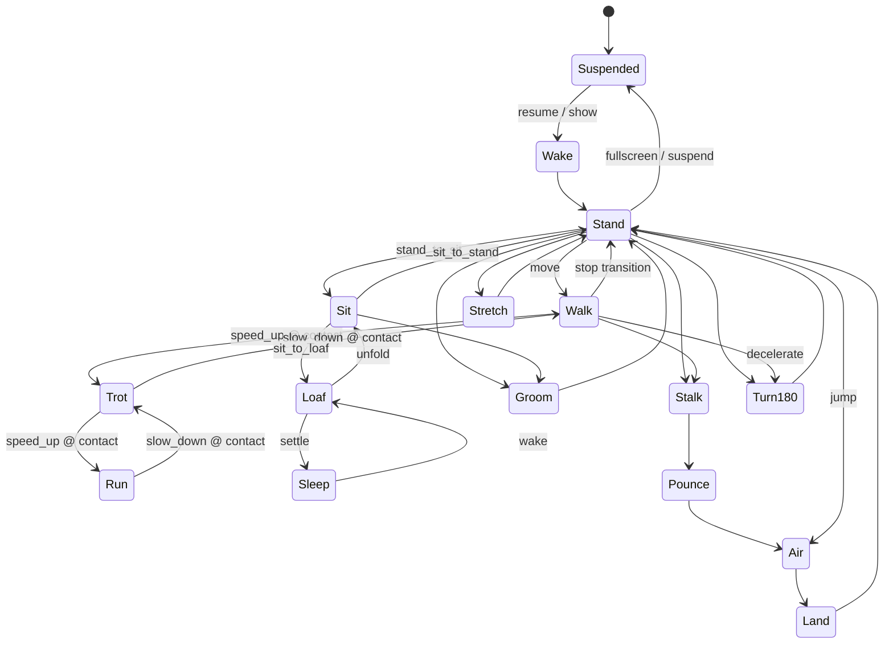

# Loading Cow Cat · 6 fps 像素逐帧动画规范 v1

## 0. 决策与边界

- 角色本体采用**纯像素逐帧动画**，固定时间基准为 `6 fps`，即每 tick `166.666… ms`。
- 不使用骨骼、蒙皮、IK、网格变形、部件旋转、自动补间或 cross-fade。
- 每一帧都是完整绘制的猫，保证轮廓、关节和黑白花纹由画师直接控制。
- 只允许加载环等 UI 特效作为独立 sprite 层；角色身体仍是一张完整 sprite。
- 本文件是美术与运行时规范，不代表 P8 已实现。实际资源占用仍须通过 A7-pet 测量。
- 当前造型基准：`loading-cow-cat-character-model-sheet-pixel-low-v2.png`。
- 旧文件 `loading-cow-cat-pixel-rig-spec-v1.md` 已废止，禁止作为实现依据。

## 1. 为什么选逐帧

低像素角色的辨识力来自人为安排的像素簇。骨骼旋转和连续插值会改变线宽、制造灰边、白缝与单像素抖动；6 fps 逐帧动画允许每一帧重新修正猫的轮廓、重心、落脚和表情，也更接近原 meme 的卡顿感。

代价是动作数量会直接增加 atlas 面积，因此 v1 必须先做一套小而完整的核心动作，而不是同时追求大量表情与换装组合。

## 2. 固定技术口径

| 项目 | v1 口径 |
|---|---|
| 动画时基 | 固定 `6 fps` |
| 单 tick | `1000 / 6 = 166.666… ms` |
| 单帧逻辑画布 | 推荐 `128 × 128 px`，透明背景 |
| 站立基线 | 所有地面动作共享同一 ground line |
| 色板 | 角色仅 `#000000`、`#FFFFFF`、透明 |
| 过滤 | nearest-neighbor |
| 缩放 | `1x / 2x / 3x / 4x` 整数倍 |
| 插值 | 无；pose 与世界位移均按 tick 离散更新 |
| 首轮 atlas | 建议单张不超过 `2048 × 2048`，仅为 A7-pet 探针配置 |
| 方向 | 左向为母版；右向可镜像，但必须经过转身 clip |

### 像素完整性

- 禁止抗锯齿、半透明轮廓、mipmap、双线性过滤、模糊与渐变。
- 每帧 pivot、ground line、root delta 全部使用整数逻辑像素。
- 不允许运行时改变角色纵横比。
- Windows 端按 device pixel 对齐；WPF 需要 nearest-neighbor、layout rounding 与 pixel snapping。
- 150% / 200% DPI 下仍先在整数内部倍率渲染，再映射窗口，不能让 WPF 任意重采样角色贴图。

## 3. 单帧构图规则

- 成年短毛猫比例，水平脊柱，四足落地；禁止幼猫大头比例。
- 黑白边界在相邻帧中只能因真实形变而变化，不能像液体一样漂移。
- 白袜高度、额纹宽度、胸腹白区和白尾尖长度必须跨所有 clip 一致。
- 接触地面的爪在接触相位保持同一世界坐标；身体移动由该帧的 `root_dx/root_dy` 定义。
- 尾巴必须有连续黑色主体；背视图尾巴偏向一侧，白尾尖不得读成臀部白斑。
- 环眼保持轻微不对称、无高光、无笑意。眨眼最短可使用一个闭眼 tick。
- 不画双足站立、挥手、摊手、点头致意、拿物品或人类 AEIOU 口型。

## 4. Sprite 与元数据

### 推荐导出物

```text
loading-cow-cat/
├─ source/                         # 可编辑像素源文件；不由运行时加载
├─ atlas/
│  ├─ cow-cat-core-1x.png          # 透明、黑白、nearest
│  └─ cow-cat-core-1x.json
├─ fx/
│  ├─ loading-spinner-1x.png
│  └─ loading-spinner-1x.json
└─ loading-cow-cat-clips.json      # clip、转场和事件标记
```

### 每帧必须记录

```json
{
  "id": "walk_left_03",
  "rect": [384, 0, 128, 128],
  "ticks": 1,
  "pivot": [64, 112],
  "root_delta": [2, 0],
  "contacts": ["fore_far", "hind_near"],
  "events": ["paw_down_hind_near"],
  "can_exit": false
}
```

- `ticks`：该图保持多少个 6 fps tick；静止动作可复用同一张图并延长 ticks，避免重复纹理。
- `pivot`：统一世界锚点，不能依赖 atlas 裁切后的左上角。
- `root_delta`：本 tick 结束时的整数逻辑像素位移。
- `contacts`：当前锁地的爪，用于验证是否滑步。
- `events`：落脚、起跳、落地、闭眼、加载步进等离散事件。
- `can_exit`：状态机是否允许在该帧离开 clip。

## 5. 6 fps 播放器

- 使用单调时钟和固定步长 accumulator；不要用连续 `Task.Delay(166)` 累积漂移。
- 每次更新消耗完整的 `1/6 s` tick，不生成中间姿态。
- 单次卡顿最多追赶 2 tick；更长卡顿直接重同步当前状态，禁止快速补播一串动作。
- sprite 帧与 `root_delta` 在同一个 tick 提交，避免身体动画和窗口移动错相。
- 安静状态若当前图未变化则不重传纹理、不请求重绘；“6 fps”是最大动画更新率，不是强制空转率。
- 独占全屏、系统挂起或迁移离开本机时立即隐藏并释放租约，不播放退出演出。

## 6. 角色状态机



### 状态机规则

- 禁止 cross-fade。姿态差异大的状态必须有显式过渡 clip。
- 行走类循环只能在兼容的 `paw_down` 接触帧之间切换。
- 事件到达时先排队，在下一个 `can_exit=true` 帧响应；紧急隐藏除外。
- 转向必须播放 `turn_180`，由侧视 → 3/4 → 正面/背面 → 3/4 → 反向侧视，禁止一帧镜像。
- 加载状态不替换基础姿态：猫继续当前 idle，独立 `loading_spinner` 在额头上方以 6 fps 播放。
- 真实猫大部分时间静止观察。随机动作必须有冷却，不连续卖萌。

## 7. v1 动作清单

帧数指**独立绘制帧**；某些帧可通过 `ticks > 1` 延长。

| Clip | 独立帧 | 时长参考 | 说明 |
|---|---:|---:|---|
| `wake` | 4–6 | 0.67–1.0 s | 从隐藏/睡眠进入稳定站姿或趴姿 |
| `idle_stand` | 3–4 | 3–5 s | 少量呼吸帧，大量 hold |
| `idle_sit` | 3–4 | 3–6 s | 尾巴贴地，避免钟摆式摆动 |
| `idle_loaf` | 2–3 | 4–8 s | 近乎静止 |
| `sleep` | 2–3 | 4–8 s | 缓慢呼吸，可长时间停在一帧 |
| `blink` | 1–2 | 0.17–0.33 s | idle 已提供开眼帧；绘制闭眼，必要时增加半闭帧 |
| `ear_twitch` | 3 | 0.50 s | 单耳为主 |
| `tail_flick` | 6–10 | 1.0–1.67 s | 尾尖滞后，不做狗式摇尾 |
| `walk` | 8 | 1.33 s / cycle | 四拍，后爪落在同侧前爪足迹附近 |
| `trot` | 6 | 1.0 s / cycle | 对角肢成对 |
| `run` | 4 | 0.67 s / cycle | 明显脊柱收缩/伸展和腾空相位 |
| `walk_to_stop` | 3–4 | 0.50–0.67 s | 先落稳前爪再停止 root motion |
| `turn_180` | 5–6 | 0.83–1.0 s | 头先转、前足踏步、后躯跟进 |
| `stand_to_sit` | 5–6 | 0.83–1.0 s | 骨盆先下沉，前肢支撑 |
| `sit_to_stand` | 5–6 | 0.83–1.0 s | 先建立前肢支撑，再抬起后躯 |
| `sit_to_loaf` | 4–5 | 0.67–0.83 s | 两前爪依次收进胸下 |
| `loaf_to_sit` | 4–5 | 0.67–0.83 s | 两前爪依次伸出；不可默认倒放 |
| `groom_short` | 12–18 | 2–3 s | 舔爪或擦脸；可组合为长动作 |
| `stretch` | 8–10 | 1.33–1.67 s | 前爪固定，胸口下沉，骨盆抬高 |
| `stalk` | 8 | 1.33 s / cycle | 腹部低、步幅短、头部稳定 |
| `pounce` | 6–8 | 1.0–1.33 s | 蓄力、起跳、腾空、落地分相 |
| `startle` | 3 | 0.50 s | 僵住、抬肩、转耳；不做人类夸张反应 |
| `loading_spinner` | 12 | 2.0 s / cycle | 每 tick 推进一格，独立 UI atlas |

### v1 预算

- 核心交付目标：约 `100–140` 张独立角色帧，加 `12` 张加载环帧。
- 先完成站立、行走、转身、坐下、趴卧、加载六条闭环，再扩展跑跳和理毛。
- 若核心 atlas 超过单张 2K，先删除低价值变体或增加 hold，不直接升级为多张 4K。

## 8. 三层行为映射

### 表演层 · 0 token

本地状态机处理 idle、呼吸、眨眼、耳动、尾动、站坐卧、理毛、伸展和睡眠。

### 反应层 · 0 token

明确事件只触发已有 clip，例如 `look`、`startle`、`loading_spinner`、`wake`、`land`。事件不生成新帧，也不逐帧控制角色。

### 决策层 · 复用已加载助手

只接收“移动、观察、休息、开口”等高层意图。宠物没有专属常驻模型，LLM 不参与 6 fps 播放循环。

## 9. 运行与安全边界

- 宠物是纯输出面，不读取屏幕内容、窗口标题或输入焦点决定动作。
- 加载圈是 UI 状态，不是额头皮肤，也不能成为永久花纹。
- 资源只从内置白名单加载；未来换肤必须限制 atlas 尺寸、帧数、文件大小和引用路径。
- 6 fps 与单张 2K atlas 只是设计方向，不等于性能已通过。A7-pet 仍需测稳态显存、CPU、GPU、帧时间、DWM、多显示器、DPI、挂起/恢复。

## 10. 验收清单

- [ ] 所有角色帧只有纯黑、纯白与透明，无灰边和半透明像素。
- [ ] 所有 clip 固定 6 fps，帧保持时间是整数 tick。
- [ ] 没有骨骼、网格、运行时肢体旋转或自动补间。
- [ ] 四足落脚标记正确，移动时无滑步、漂脚或反关节。
- [ ] 额纹、胸腹白区、白袜和白尾尖跨所有帧一致。
- [ ] 转身使用专门 clip，不瞬间镜像。
- [ ] 加载环独立，可与 idle 同时播放。
- [ ] 没有双足动作、人类手势、人类口型或可爱化表情。
- [ ] 1x–4x 最近邻缩放清晰，150% / 200% DPI 下无重采样糊边。
- [ ] 已完成 A7-pet 后，才在项目状态中声明渲染方案通过。
