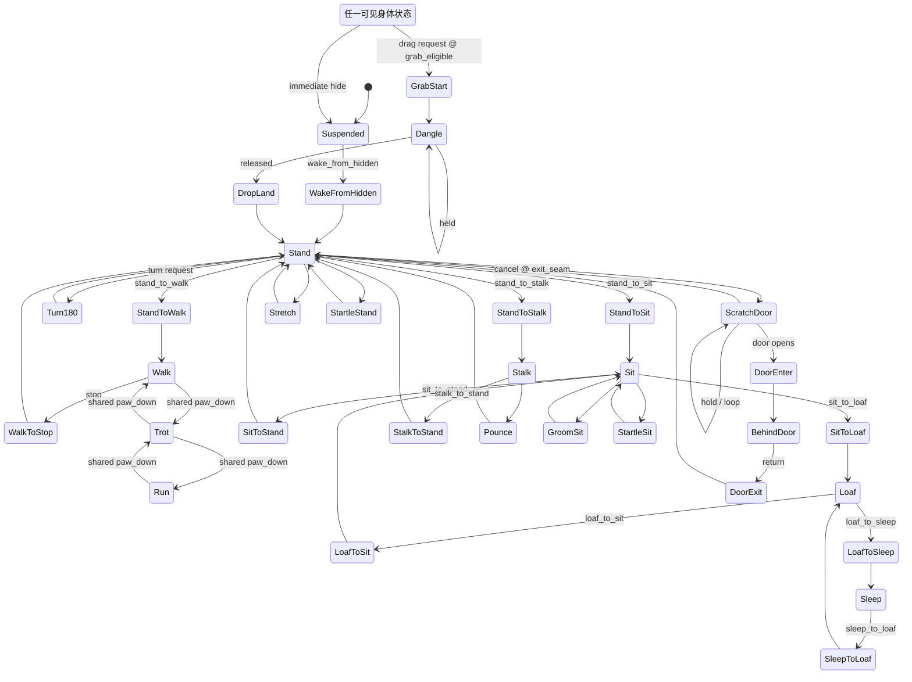
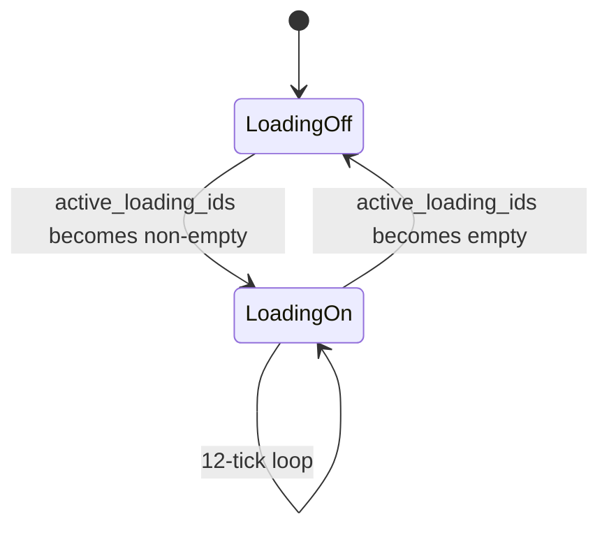

# Loading Cow Cat · 6 fps 像素逐帧动画规范 v1

## 0. 决策与边界

- 角色本体采用**纯像素逐帧动画**，固定时间基准为 `6 fps`，即每 tick `166.666… ms`。
- 不使用骨骼、蒙皮、IK、网格变形、部件旋转、自动补间或 cross-fade。
- 每一帧都是完整绘制的猫，保证轮廓、关节和黑白花纹由画师直接控制。
- 只允许加载环等 UI 特效作为独立 sprite 层；角色身体仍是一张完整 sprite。
- 本文件是美术与运行时规范，不代表 P8 已实现。实际资源占用仍须通过 A7-pet 测量。
- 当前造型基准：`loading-cow-cat-character-model-sheet-pixel-low-v2.png`。
- 旧文件 `loading-cow-cat-pixel-rig-spec-v1.md` 已废止，禁止作为实现依据。
- 本版动作清单以 2026-08-03 提交的 `v1a` 需求为权威输入；机器可读镜像见 `loading-cow-cat-animation-manifest-v1.json`。
- 经逐项复核，`v1a` 是 **84 张角色帧 + 12 张加载环**；输入表尾的 82 少计了 `stand_to_walk` 的 2 张。

## 1. 为什么选逐帧

低像素角色的辨识力来自人为安排的像素簇。骨骼旋转和连续插值会改变线宽、制造灰边、白缝与单像素抖动；6 fps 逐帧动画允许每一帧重新修正猫的轮廓、重心、落脚和表情，也更接近原 meme 的卡顿感。

代价是动作数量会直接增加 atlas 面积，因此 v1 必须先做一套小而完整的核心动作，而不是同时追求大量表情与换装组合。

## 2. 固定技术口径

| 项目 | v1 口径 |
|---|---|
| 动画时基 | 固定 `6 fps` |
| 单 tick | `1000 / 6 = 166.666… ms` |
| 单帧逻辑画布 | 推荐 `128 × 128 px`，透明背景 |
| 站立基线 | 所有地面动作共享同一 ground line |
| 色板 | 角色仅 `#000000`、`#FFFFFF`、透明 |
| 过滤 | nearest-neighbor |
| 缩放 | `1x / 2x / 3x / 4x` 整数倍 |
| 插值 | 无；pose 与世界位移均按 tick 离散更新 |
| 首轮 atlas | 建议单张不超过 `2048 × 2048`，仅为 A7-pet 探针配置 |
| 方向 | 左向为母版；右向可镜像，但必须经过转身 clip |

### 像素完整性

- 禁止抗锯齿、半透明轮廓、mipmap、双线性过滤、模糊与渐变。
- 每帧 pivot、ground line、root delta 全部使用整数逻辑像素。
- 不允许运行时改变角色纵横比。
- Windows 端按 device pixel 对齐；WPF 需要 nearest-neighbor、layout rounding 与 pixel snapping。
- 150% / 200% DPI 下仍先在整数内部倍率渲染，再映射窗口，不能让 WPF 任意重采样角色贴图。

## 3. 单帧构图规则

- 成年短毛猫比例，水平脊柱，四足落地；禁止幼猫大头比例。
- 黑白边界在相邻帧中只能因真实形变而变化，不能像液体一样漂移。
- 白袜高度、额纹宽度、胸腹白区和白尾尖长度必须跨所有 clip 一致。
- 接触地面的爪在接触相位保持同一世界坐标；身体移动由该帧的 `root_dx/root_dy` 定义。
- 尾巴必须有连续黑色主体；背视图尾巴偏向一侧，白尾尖不得读成臀部白斑。
- 环眼保持轻微不对称、无高光、无笑意。眨眼最短可使用一个闭眼 tick。
- 不画双足站立、挥手、摊手、点头致意、拿物品或人类 AEIOU 口型。

## 4. Sprite 与元数据

### 推荐导出物

```text
loading-cow-cat/
├─ source/                         # 可编辑像素源文件；不由运行时直接加载
│  └─ body-clips/
│     ├─ door_enter_left_1x.png   # 4×1，每格 128×128
│     └─ door_exit_left_1x.png    # 4×1，每格 128×128
├─ atlas/
│  ├─ cow-cat-core-1x.png          # 透明、黑白、nearest
│  └─ cow-cat-core-1x.json
├─ fx/
│  ├─ loading-spinner-1x.png
│  └─ loading-spinner-1x.json
└─ loading-cow-cat-clips.json      # clip、转场和事件标记
```

### 每帧必须记录

```json
{
  "id": "walk_left_03",
  "source_index": 3,
  "rect": [384, 0, 128, 128],
  "ticks": 1,
  "pivot": [64, 112],
  "fx_anchor": [64, 26],
  "root_delta": [2, 0],
  "contacts": ["fore_far", "hind_near"],
  "events": ["paw_down_hind_near"],
  "can_exit": false
}
```

- `ticks`：该图保持多少个 6 fps tick；静止动作可复用同一张图并延长 ticks，避免重复纹理。
- `pivot`：统一世界锚点，不能依赖 atlas 裁切后的左上角。
- `fx_anchor`：加载环的整数像素锚点；每张可显示身体帧都要提供，拖拽时仍能跟随头部。
- `root_delta`：本 tick 结束时的整数逻辑像素位移。
- `contacts`：当前锁地的爪，用于验证是否滑步。
- `events`：落脚、起跳、落地、闭眼、加载步进等离散事件。
- `can_exit`：状态机是否允许在该帧离开 clip。
- `source_index`：该帧在可编辑源 sheet 中的零基 cell 序号；打 atlas 后仍保留以便回溯。
- `door_anchor_offset`：仅门交互使用；角色 pivot 相对 `portal.bottom_center` 的整数偏移，记录在左向母版空间。运行时镜像时 x 与 `root_delta.x` 一起取反。
- `render_profile`：仅门交互使用；`outside` 不做 portal 裁切，`behind` 同时把猫与加载环裁到固定 `portal_mask` 内。
- `visible_fraction`：使用实际门资产、运行时方向、portal 裁切和 `front` 遮挡合成后，可见猫实体像素数除以原始完整猫实体像素数。该数值由验证器测量，不能目测填写。

## 5. 6 fps 播放器

- 使用单调时钟和固定步长 accumulator；不要用连续 `Task.Delay(166)` 累积漂移。
- 每次更新消耗完整的 `1/6 s` tick，不生成中间姿态。
- 单次卡顿最多追赶 2 tick；更长卡顿直接重同步当前状态，禁止快速补播一串动作。
- sprite 帧与 `root_delta` 在同一个 tick 提交，避免身体动画和窗口移动错相。
- 安静状态若当前图未变化则不重传纹理、不请求重绘；“6 fps”是最大动画更新率，不是强制空转率。
- 独占全屏、系统挂起或迁移离开本机时立即隐藏并释放租约，不播放退出演出。

## 6. 角色状态机



### 状态机规则

- 禁止 cross-fade。表 4 的姿态过渡都是图上的边，进入后必须完整播放。
- 行走类循环只能在兼容的 `paw_down` 接触帧之间切换。
- 普通事件在下一个 `can_exit=true` 帧响应；系统挂起立即隐藏，拖拽以用户输入优先级抢占身体轨。
- `turn_180` 唯一母版是 L→R，镜像得到 R→L。坐姿与趴姿不得直接转身，必须先回到 Stand。
- `pounce` 一条 clip 内含蓄力、起跳、腾空和落地，不再引用没有素材的 Air/Land 状态。
- `scratch_door` 必须有一个四爪落地、可无缝接 `idle_stand` 的 `exit_seam`；取消时不新增 `scratch_to_stand`。
- `door_enter` 的终点是 `BehindDoor`；`door_exit` 从门后起步并回到 Stand。`BehindDoor` 与系统 `Suspended` 是两个状态。
- 系统挂起会取消门事务；恢复后统一走 `wake_from_hidden`，不续播被打断的门动画。
- `grab_start` 只有一个版本。v1a 接受从站、坐、趴、走或扒门进入时最多一 tick 的姿态归一跳变，不为每个来源新增 grab 变体。
- 除系统立即隐藏外，grab 不打断 must-finish clip：请求先 pending；Walk 在接触帧、ScratchDoor 在 `exit_seam`、稳定 idle 在下一 tick 进入。
- 图中的 `AnyVisible` 不包含 `Suspended` 与 `BehindDoor`；猫在门后或系统隐藏时不可拖拽。
- 加载环是唯一并行层：身体维持当前 clip，通过每帧 `fx_anchor` 跟随头部；身体隐藏时加载环也隐藏。
- 真实猫大部分时间静止观察。idle 插入是身体轨短 clip，不是第二条身体动画层。

### 加载层正交状态



- 不能用单一 Boolean；并发任务以 `active_loading_ids` 集合计数，集合非空才显示。
- `Suspended` 与 `BehindDoor` 不绘制加载环，但逻辑加载可继续。
- 重新可见时按单调时钟同步到当前相位，不快速补播错过的帧。
- 加载开始与结束不等待身体 `can_exit`，也不进入身体事件队列。

### 事件优先级

1. `suspend / exclusive_fullscreen / lease_lost / exit`：唯一可打断 must-finish 的事件；立即隐藏、释放鼠标捕获并清队列。
2. 加载层事件：正交处理，不与身体轨竞争。
3. 拖拽生命周期：请求可 pending；进入 Dangle 后忽略门、移动和 idle 请求，release 只走 `drop_land`。
4. 当前 must-finish clip：除立即隐藏外必须完整播完。
5. 门事务：`door_enter / door_exit` 开始后必须闭合。
6. 显式行为与助手请求。
7. 移动、朝向与姿态目标：同类只保留最新目标。
8. `blink / ear_twitch / tail_flick`：最低优先级，忙时直接丢弃。

## 7. 动画需求清单

按 6 fps 口径，`1 tick = 1/6 s`。**独立帧**是要绘制的图张数，**ticks**是单轮总步数（含 hold）。`v1a` 的 `●` 是家用最小闭环。

### 7.0 加载环 · 唯一独立并行层

| Clip | 独立帧 | ticks | 时长 | v1a |
|---|---:|---:|---:|:--:|
| `loading_spinner` | 12 | 12 | 2.000 s / 循环 | ● |

### 7.1 静止姿态

| Clip | 独立帧 | ticks | 时长 | v1a |
|---|---:|---:|---:|:--:|
| `idle_stand` | 3 | 24 | 4.000 s / 轮 | ● |
| `idle_sit` | 4 | 30 | 5.000 s / 轮 | ● |
| `idle_loaf` | 3 | 36 | 6.000 s / 轮 | ● |
| `sleep` | 3 | 36 | 6.000 s / 轮 |  |

### 7.2 idle 插入变体 · 身体轨

| Clip | 独立帧 | ticks | 时长 | v1a |
|---|---:|---:|---:|:--:|
| `blink_stand` | 1 | 1 | 0.167 s | ● |
| `blink_sit` | 1 | 1 | 0.167 s | ● |
| `blink_loaf` | 1 | 1 | 0.167 s | ● |
| `ear_twitch_sit` | 3 | 3 | 0.500 s |  |
| `ear_twitch_loaf` | 3 | 3 | 0.500 s |  |
| `tail_flick_sit` | 6 | 8 | 1.333 s |  |

### 7.3 移动循环

| Clip | 独立帧 | ticks | 时长 | v1a |
|---|---:|---:|---:|:--:|
| `walk` | 8 | 8 | 1.333 s / 循环 | ● |
| `trot` | 6 | 6 | 1.000 s / 循环 |  |
| `run` | 4 | 4 | 0.667 s / 循环 |  |
| `stalk` | 8 | 8 | 1.333 s / 循环 |  |

### 7.4 姿态过渡 · 必须播完

| Clip | 独立帧 | ticks | 时长 | v1a |
|---|---:|---:|---:|:--:|
| `stand_to_walk` | 2 | 2 | 0.333 s | ● |
| `walk_to_stop` | 4 | 4 | 0.667 s | ● |
| `turn_180` | 6 | 6 | 1.000 s | ● |
| `stand_to_sit` | 6 | 6 | 1.000 s | ● |
| `sit_to_stand` | 6 | 6 | 1.000 s | ● |
| `sit_to_loaf` | 5 | 5 | 0.833 s | ● |
| `loaf_to_sit` | 5 | 5 | 0.833 s | ● |
| `loaf_to_sleep` | 3 | 6 | 1.000 s |  |
| `sleep_to_loaf` | 3 | 6 | 1.000 s |  |
| `stand_to_stalk` | 4 | 4 | 0.667 s |  |
| `stalk_to_stand` | 4 | 4 | 0.667 s |  |

### 7.5 表演动作

| Clip | 独立帧 | ticks | 时长 | v1a |
|---|---:|---:|---:|:--:|
| `groom_sit` | 14 | 18 | 3.000 s |  |
| `stretch` | 9 | 10 | 1.667 s |  |
| `startle_stand` | 3 | 3 | 0.500 s |  |
| `startle_sit` | 3 | 3 | 0.500 s |  |
| `pounce` | 8 | 8 | 1.333 s |  |

### 7.6 出场

| Clip | 独立帧 | ticks | 时长 | v1a |
|---|---:|---:|---:|:--:|
| `wake_from_hidden` | 5 | 6 | 1.000 s | ● |

退场不画。挂起和独占全屏立即隐藏。

### 7.7 门

| Clip | 独立帧 | ticks | 时长 | v1a |
|---|---:|---:|---:|:--:|
| `scratch_door` | 6 | 8 | 1.333 s / 循环 | ● |
| `door_enter` | 4 | 4 | 0.667 s | ● |
| `door_exit` | 4 | 4 | 0.667 s | ● |

正式源文件是两张 PNG sheet：`source/body-clips/door_enter_left_1x.png` 与 `door_exit_left_1x.png`，均为 `512×128`、4 个 `128×128` cell。每格必须画完整猫；不得把钻进门后的身体预先从 PNG 擦掉。

- `door_enter` 绑定右侧 `door_desktop`，运行时镜像为向右钻入；门板固定在 fully-open frame 3。第 2 张角色帧触发唯一一次 `portal_enter`，profile 从 `outside` 切到 `behind`。
- `door_exit` 绑定左侧跨客户端软猫窝门，运行时镜像为向右钻出。第 4 张角色帧触发唯一一次 `portal_exit`，profile 从 `behind` 切回 `outside`。
- `door_enter.visible_fraction` 必须逐帧严格下降；`door_exit.visible_fraction` 必须逐帧严格上升。最后一个 tick 的 `root_delta` 必须把角色彻底移出门平面，再进入下一个状态。
- 门的 `back` 始终在猫后，`front` 始终在猫前；`portal_mask` 不渲染，只裁切猫和头部加载环。门不随角色镜像。
- 跨客户端门不是建筑拱门。它是厚薄不均、顶部带压痕、底部有柔软近景唇边的猫窝式穿行洞；没有睡垫、屋顶、房间背景或休息语义。
- 穿洞动作保持真实四足低姿：前腿探入/落地、躯干通过、后腿蹬地、尾巴最后通过；不缩猫、不压扁身体、不改洞口尺寸。

### 7.8 拖拽

| Clip | 独立帧 | ticks | 时长 | v1a |
|---|---:|---:|---:|:--:|
| `grab_start` | 2 | 2 | 0.333 s | ● |
| `dangle` | 4 | 8 | 1.333 s / 循环 | ● |
| `drop_land` | 4 | 4 | 0.667 s | ● |

## 8. 帧预算与削减方案

| 方案 | 角色帧 | 加载环 | 全部独立图 |
|---|---:|---:|---:|
| **v1a 最小集 · 推荐** | **84** | **12** | **96** |
| 完整集 | 168 | 12 | 180 |
| 完整集，仅复用 sleep | 159 | 12 | 171 |
| 完整集，仅砍 `trot/run/stalk/pounce` | 142 | 12 | 154 |
| 完整集，两项都做 | **133** | **12** | **145** |

复核算式：

```text
v1a = 静止 10 + blink 3 + walk 8 + 过渡 34 + 出场 5 + 门 14 + 拖拽 10 = 84
完整 = 静止 13 + idle变体 15 + 移动 26 + 过渡 48 + 表演 37 + 出场 5 + 门 14 + 拖拽 10 = 168
```

- 输入表尾的 82 恰好少计 `stand_to_walk` 的 2 张。建议保留这 2 张，以 **84** 为生产预算。
- 若 82 是硬上限，唯一明确方案是让 `stand_to_walk` 的 2 tick 分别引用 `idle_stand` 终帧与 `walk` 首帧，并把它的“新增独立帧”改成 0；不能一边声明 2 张独立帧、一边按 0 张计数。
- sleep 复用会省 `sleep 3 + loaf_to_sleep 3 + sleep_to_loaf 3 = 9` 张，但这些原本都不属于 v1a，因此不会改变 v1a 合计。
- 若 v1a 需要“睡着”的逻辑语义，可把 Loaf 切成闭眼子模式：复用 `blink_loaf` 闭眼帧无限 hold，唤醒时切回 `idle_loaf`，仍不新增这 9 张。
- 只砍四个高移动 clip 会得到 142，仍超出 140；与 sleep 复用同时执行才得到 133，回到原预算内。

### v1a 出图批次

| 批次 | 内容 | 新增角色帧 | 累计 |
|---|---|---:|---:|
| A · 身份锁定 | 三个 idle + 三个 blink | 13 | 13 |
| B · 基础移动 | `walk`、起步、停止、转身 | 20 | 33 |
| C · 姿态闭环 | 站坐趴双向四条过渡 | 22 | 55 |
| D · 出场 | `wake_from_hidden` | 5 | 60 |
| E · 家门 | `scratch_door`、`door_enter`、`door_exit` | 14 | 74 |
| F · 拖拽 | `grab_start`、`dangle`、`drop_land` | 10 | 84 |

加载环 12 张单独出图和验收，不计入角色帧累计。每一批先通过花纹、ground line 和状态缝合检查，再进入下一批，避免 84 张全部画完后才发现基准漂移。

门是角色 atlas 之外仅存的场景依赖：`doors/door_desktop.png` 4 帧、`doors/door_corridor.png` 1 帧是兼容合成图；正式渲染使用同目录的 `back / leaf / front / portal_mask` 分层，契约见 `doors/door-assets-v1.json`。Desktop 是按未缩放猫尺寸放大的家门猫洞；Corridor 是通往另一个客户端的常开圆洞隧道，不是睡眠猫窝。猫在门外时位于 leaf 之后、front 之前；跨过门平面后切换为 portal-clipped 的 behind profile，加载环必须与身体一起裁切。整个 clip 中 portal 几何固定，Desktop 仅 leaf 可变化，Corridor 没有活动门层。它们不计入猫本体 84/168 或加载环 12 的帧预算。地板、背景、睡眠设施与挠门特效均取消。

## 9. 给生成方的硬约束

1. 全部按左向绘制，右向运行时镜像。`turn_180` 例外：只画 L→R，镜像即得 R→L。
2. 坐姿和趴姿没有转身 clip；必须先起身，再播放 `turn_180`。
3. 使用 128×128 透明画布；所有地面动作共享同一 ground line，pivot 与 `fx_anchor` 都取整数像素。
4. 色板只有 `#000000`、`#FFFFFF`、透明；无抗锯齿、灰边或半透明像素。
5. 额纹宽度、胸腹白区、白袜高度、白尾尖长度必须跨全部 clip 一致。
6. 移动帧必须标整数 `root_delta` 和接触爪；接触相位锁地，不滑步。
7. 禁止双足站立、挥手摊手、点头致意、拿物品、人类口型和可爱化表情。
8. `grab_start / dangle` 中四肢自然垂下，禁止变成人形吉祥物被举起。
9. `scratch_door` 是四足猫后足落地、前爪扒门；不是双足站立扒墙。
10. 每个过渡 clip 都必须完整播放；不得用 cross-fade 或运行时补间代替缺帧。
11. `scratch_door` 至少有一个指定 `exit_seam`，该帧四爪落地并可直接接 `idle_stand`。

## 10. 三层行为映射

### 表演层 · 0 token

本地状态机处理 idle、呼吸、眨眼、耳动、尾动、站坐卧、理毛、伸展和睡眠。

### 反应层 · 0 token

明确事件只触发已有 clip，例如 `look`、`startle`、`loading_spinner`、`wake`、`land`。事件不生成新帧，也不逐帧控制角色。

### 决策层 · 复用已加载助手

只接收“移动、观察、休息、开口”等高层意图。宠物没有专属常驻模型，LLM 不参与 6 fps 播放循环。

## 11. 运行与安全边界

- 宠物是纯输出面，不读取屏幕内容、窗口标题或输入焦点决定动作。
- 加载圈是 UI 状态，不是额头皮肤，也不能成为永久花纹。
- 资源只从内置白名单加载；未来换肤必须限制 atlas 尺寸、帧数、文件大小和引用路径。
- 6 fps 与单张 2K atlas 只是设计方向，不等于性能已通过。A7-pet 仍需测稳态显存、CPU、GPU、帧时间、DWM、多显示器、DPI、挂起/恢复。

## 12. 验收清单

- [ ] 所有角色帧只有纯黑、纯白与透明，无灰边和半透明像素。
- [ ] 所有 clip 固定 6 fps，帧保持时间是整数 tick。
- [ ] manifest 自动复核为 v1a 84 角色帧、完整集 168 角色帧、加载环 12 帧。
- [ ] 没有骨骼、网格、运行时肢体旋转或自动补间。
- [ ] 四足落脚标记正确，移动时无滑步、漂脚或反关节。
- [ ] 额纹、胸腹白区、白袜和白尾尖跨所有帧一致。
- [ ] 转身使用专门 clip，不瞬间镜像。
- [ ] 加载环独立，可与 idle 同时播放。
- [ ] 没有双足动作、人类手势、人类口型或可爱化表情。
- [ ] 1x–4x 最近邻缩放清晰，150% / 200% DPI 下无重采样糊边。
- [ ] 已完成 A7-pet 后，才在项目状态中声明渲染方案通过。
