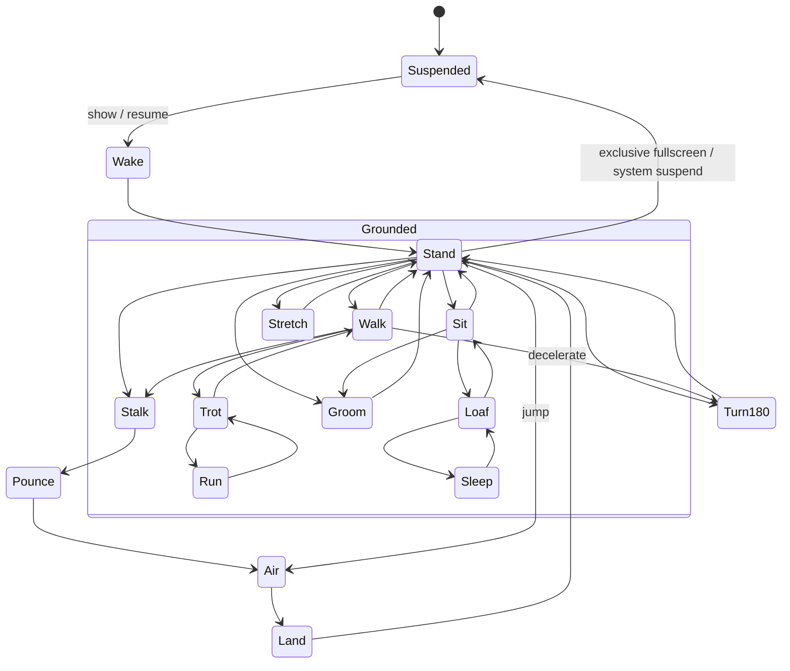

# Loading Cow Cat · 像素角色与 2D 骨骼规范 v1

## 0. 当前边界

- 本文件是**角色美术、拆件与动画状态机规范**，不是 P8 已实现证明。
- 当前推荐按 DragonBones 类骨骼/槽位方案准备素材；正式渲染后端仍须通过 A7-pet 实测。
- 当前主视觉参考：`loading-cow-cat-character-model-sheet-pixel-low-v2.png`（约 `192×128` 逻辑像素语言）。
- `loading-cow-cat-character-model-sheet-pixel-v1.png` 保留为较高像素密度的对照稿，不作为当前造型基准。
- 模型表只用于造型校准，**不能直接当拆件图集**；正式 atlas 必须补齐所有被遮挡关节与重叠像素。

## 1. 角色定义

这是一只成年、短毛、正常体型的黑白奶牛猫，也是 Vigil 的非拟人化形体。它以真正的猫的方式站、走、坐、伏、跳、理毛和睡觉，不直立行走，不做人的手势。

核心气质是“系统卡住时一只猫在无意义地凝视你”：诡异、呆滞、略微失真，但不是可爱吉祥物。

### 必须锁定的视觉识别

- 黑色：头顶、双耳外侧、眼周、背部、两侧躯干、尾巴主体。
- 白色：窄额纹、宽口鼻、喉胸、下腹、四只白袜、很短的白色尾尖。
- 眼睛：略不对称的白色空心环，内部保持黑色；不加高光，不做水汪汪大眼。
- 嘴：闭合、僵硬、无微笑；只为哈欠、舔毛、叫声做少量替换帧。
- 加载环：独立 `fx_loading` UI 槽，不是额头花纹，不随皮肤变形。
- 角色贴图只允许 `#000000` 与 `#FFFFFF`；透明背景不计入颜色。

### 明确禁止

- 双足站立、挥手、摊手、敬礼、点头致意、拿物品等拟人动作。
- 大头短腿、幼猫比例、腮红、笑脸等 kawaii/chibi 语言。
- 人类 AEIOU 口型。系统说话时猫保持闭嘴或仅有极轻的下颌呼吸包络。
- 把加载圈永久画进额头，或把白斑拆成会在身体表面漂移的覆盖层。

## 2. 像素语言

### 基础规则

- 以低分辨率逻辑画布绘制，再用 nearest-neighbor 整数倍放大。
- 推荐第一轮探针以角色站姿高度约 `96 logical px` 为基准；最终屏幕尺寸由客户端缩放决定。
- 只允许 `1x / 2x / 3x / 4x` 整数缩放，不允许 125% 一类任意贴图缩放。
- 禁用抗锯齿、双线性过滤、mipmap、模糊与半透明轮廓。
- 动画关键帧以 `12 fps` 像素节奏创作；显示线程可更高频，但姿态采样采用 stepped/hold，不自动制造中间的糊像素。
- 所有槽位 pivot、IK 落脚点与 root motion 在最终合成前吸附到整数像素。

### 骨骼与像素的折中

- 躯干和四肢优先使用刚性像素块；不要对小部件做自由网格拉伸。
- 胸腹压缩用 2–3 个可替换轮廓帧，而不是连续 squash。
- 眼睛、嘴、爪尖、耳尖使用 sprite swap，避免缩放生成碎像素。
- 尾巴可用 7 段骨骼，但每段保留 3–5 px 黑色重叠；高弯曲姿态补专用尾巴替换帧。
- 旋转后的轮廓必须人工检查；出现断线、单像素孔或粗细跳变时，新增替换帧而非继续插值。

## 3. 主绑定姿态

- 左向侧视、四足落地、水平脊柱、头略高于肩。
- 近侧与远侧腿错开 2–4 logical px，使四条腿都可读。
- root 位于骨盆/重心，不放在胸口或画布中心。
- 关节拆件在不可见方向预留 12%–20% 隐藏重叠，运动时不得露缝。
- 背视图的尾巴要向一侧偏出，使“黑尾 + 小白尾尖”可读；禁止让白尾尖看成臀部白斑。

## 4. 骨骼与槽位层级

```text
world_root                         # 桌面坐标；不烘进动作
└─ body_root / pelvis              # 重心与全身 root motion
   ├─ spine_lumbar
   │  └─ spine_chest
   │     ├─ neck
   │     │  └─ head
   │     │     ├─ muzzle
   │     │     ├─ jaw
   │     │     ├─ ear_near_01 → ear_near_02
   │     │     ├─ ear_far_01  → ear_far_02
   │     │     ├─ eye_near / eyelid_near
   │     │     ├─ eye_far  / eyelid_far
   │     │     └─ fx_loading       # 独立像素 UI
   │     ├─ scapula_near
   │     │  └─ upper_fore_near → forearm_near → carpus_near → forepaw_near
   │     └─ scapula_far
   │        └─ upper_fore_far  → forearm_far  → carpus_far  → forepaw_far
   ├─ thigh_near → shank_near → hock_near → hindpaw_near
   ├─ thigh_far  → shank_far  → hock_far  → hindpaw_far
   └─ tail_01 → tail_02 → tail_03 → tail_04 → tail_05 → tail_06 → tail_07
```

绑定要点：

- 前腿必须保留肩胛骨沿胸廓滑动，不能像人的固定肩膀。
- 后腿保持“膝向前、飞节向后”；不能画成人类反关节。
- 四爪各设 IK/接触点。站立相位锁足，世界移动由 `world_root` 驱动，禁止滑步。
- 骨盆—腰—胸三段承担猫的收缩、伸展和奔跑脊柱波动。
- 尾根跟随骨盆，后续节点逐段延迟；白尾尖烘在 `tail_07` 贴图内。
- 黑白花纹烘进各身体部件。关节交界处两张贴图都延伸同色像素，避免旋转时出现白缝。

## 5. 绘制与遮挡顺序

默认左向侧视，由后到前：

```text
tail_far
far_hind_leg
far_fore_leg
body
near_hind_leg
near_fore_leg
neck
far_ear
head
near_ear
eyes_and_lids
fx_loading
```

侧视向右时使用镜像骨架，但必须经过 `turn_180` 动画切换；禁止一帧内瞬间翻面。若未来加入非对称装饰，则左右方向必须改用独立贴图。

## 6. 动画状态机



### 并行动画通道

- `breath`：胸腹极轻起伏。
- `blink`：开眼 / 半闭 / 闭眼三帧替换。
- `eye_saccade`：环眼内黑心最多移动 1 logical px，低频、不同步。
- `ear_attention`：耳朵各自转动或轻抖。
- `tail_mood`：尾尖与尾根不同相位。
- `head_look`：先眼、再耳、最后头部；避免人类式立即转头。
- `fx_loading`：独立 12 格像素加载环，可与任意基础姿态并行。

### 首批动作与节奏

| Clip | 建议时长 / 帧数 | 规则 |
|---|---:|---|
| `idle_stand` | 3–5 s loop | 大部分时间近乎静止，只保留呼吸 |
| `blink` | 2–3 frames @12 fps | 两眼可相差 1 帧，避免卖萌眨眼 |
| `ear_twitch` | 3–4 frames | 单耳为主，180–300 ms 后复位 |
| `tail_sway` | 2.5–5 s loop | 尾尖滞后；不做狗式摇尾 |
| `walk` | 10–13 frames | 四拍步态；后爪踏入同侧前爪落点附近 |
| `trot` | 7–9 frames | 对角肢成对，脊柱只轻微起伏 |
| `run` | 5–7 frames | 才允许明显脊柱收缩/伸展与腾空相位 |
| `turn_180` | 8–12 frames | 头先转、前足踏步、后躯跟进、尾巴反向平衡 |
| `sit_down` | 9–13 frames | 骨盆先下沉，前肢保持支撑 |
| `loaf_enter` | 12–18 frames | 两只前爪依次收进胸下 |
| `groom` | 4–12 s | 舔爪、擦脸或舔肩；不循环得像机器 |
| `stretch` | 18–28 frames | 前爪固定，胸口下沉，骨盆抬高 |
| `stalk` | 10–14 frames loop | 腹部低、步幅短、头部稳定 |
| `pounce` | 8–11 frames | 后腿蓄力、起跳、空中、落地分段 |
| `startle` | 4–6 frames | 短暂停顿、肩背抬高、耳转向，再决定退避 |
| `loading_fx` | 10–14 frames loop | 12 格逐格推进；身体继续呼吸与偶发耳动 |
| `sleep` | 4–7 s loop | 极低频呼吸；可降为静帧 + 定时更新 |

### 转场规则

- `walk / trot / run` 以体长/秒归一化并设置迟滞区，避免速度边界抖动。
- 循环动作只在兼容的落脚事件上切换；不要任意 cross-fade 四肢。
- 起步先转移重量，再抬爪；停止时先落稳前爪，再收 root motion。
- 转向必须播放 `turn_180`；移动中先减速，不能瞬间镜像或倒着滑。
- 加载不会冻结猫。基础层继续呼吸，眼神慢漂，偶发耳动；只让加载环循环。
- 错误反应使用短暂僵住、耳朵后压或头部微抽动；不抱头、不摊手、不生气跺脚。
- 真实猫大量时间是在观察。所有随机动作都要有冷却，禁止持续表演式卖萌。

## 7. 项目三层映射

### 表演层 · 0 token

`idle_*`、呼吸、眨眼、耳动、尾动、站坐卧、理毛、伸展、睡眠。全部由本地确定性状态机与带种子的低频随机器驱动。

### 反应层 · 0 token

明确事件触发 `look`、`alert`、`startle`、`loading_fx`、`wake`、`land` 等短动作。事件只选 clip，不逐帧控制骨骼。

### 决策层 · 复用已加载助手

只输出高层意图，例如“去某个驻留点”“休息”“观察”“开口”。不得给宠物另驻一个模型，也不得让 LLM 决定每一帧。

## 8. 运行与安全边界

- 宠物是纯输出面：不得读取屏幕内容、窗口标题或输入焦点来决定动作。
- 独占全屏或系统挂起时直接隐藏并释放租约，不播放耗时离场动画。
- 安静待机可降至 12–15 fps；睡眠尽量静帧不重绘。活跃帧率与图集规模需由 A7-pet 决定。
- 第一轮性能探针建议只用单张 2K atlas、约 35–40 根骨、少量替换帧；这是测试配置，不是已批准上限。
- 未来允许换肤时，素材必须经白名单与限额：纹理尺寸、骨骼数、槽位数、文件大小、引用路径均需限制。

## 9. 正式拆件验收清单

- [ ] 每个视角的额纹、胸腹白区、四只白袜和白尾尖边界一致。
- [ ] 背视图尾巴偏向一侧，白尾尖不会读成臀部白斑。
- [ ] 四条腿、肩、髋、颈、尾根都有完整隐藏面与像素重叠。
- [ ] 所有部件只含纯黑、纯白与透明，无灰边、无半透明像素。
- [ ] 最近邻缩放后无断线、白缝、单像素孔或漂移的花纹。
- [ ] 四足接触事件明确，慢走无滑步，后腿结构符合猫科。
- [ ] 没有双足动作、人类手势、人类口型或可爱化表情。
- [ ] `fx_loading` 可独立显示、隐藏、旋转，并且不修改角色贴图。
- [ ] 已覆盖静止、行走、奔跑、加载环、150%/200% 系统缩放、多显示器、挂起/恢复的 A7-pet 测试。
